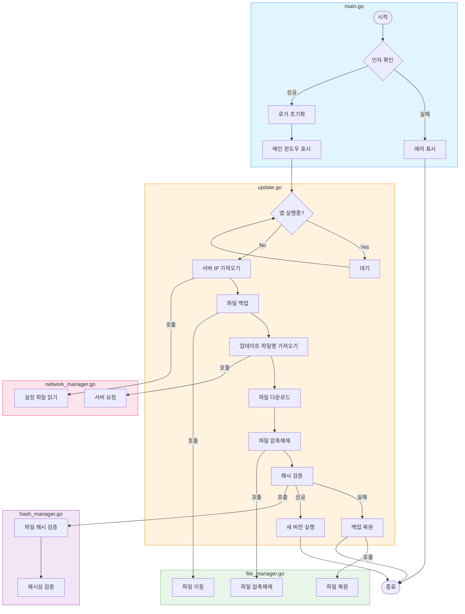

# dupdater
## Project Structure

```
dupdater/
├── cmd/
    └── dupdater/
    │   └── main.go
├── internal/
    ├── app/
    │   └── updater.go
    ├── file/
    │   └── manager.go
    ├── hash/
    │   └── manager.go
    ├── i18n/
    │   ├── locale/
    │   │   ├── en.go
    │   │   └── ko.go
    │   ├── manager.go
    │   └── types.go
    ├── logger/
    │   ├── domain/
    │   │   ├── entity/
    │   │   │   ├── log_entry.go
    │   │   │   └── log_level.go
    │   │   ├── ports/
    │   │   │   └── logger_port.go
    │   │   ├── repository/
    │   │   │   └── log_repository.go
    │   │   └── usecase/
    │   │   │   └── logger_service.go
    │   ├── infrastructure/
    │   │   └── file_logger.go
    │   ├── factory.go
    │   └── logger.go
    ├── network/
    │   └── manager.go
    ├── ui/
    │   ├── components/
    │   │   ├── resources.go
    │   │   └── status_card.go
    │   ├── theme/
    │   │   ├── dark_variant.go
    │   │   ├── light_variant.go
    │   │   ├── theme_variant.go
    │   │   └── types.go
    │   ├── manager.go
    │   └── resources.go
    └── version/
    │   ├── manger.go
    │   └── types.go
├── pkg/
    └── utils/
    │   ├── count.go
    │   └── system.go
└── Readme.md
```

## Readme.md
```md
# 빌드하는 방법

```bash
fyne package -icon icon.png -name updater
```


## 커스텀 아이콘 사용하는 방법

```bash
fyne bundle -o bundled.go icon.png
```

```go
    icon := fyne.NewStaticResource("icon", resourceIconPng.StaticContent)

	ui.spinnerIcon = widget.NewIcon(icon)
	ui.spinnerIcon.Resize(fyne.NewSize(50, 50))
```

위처럼 사용할 수 있다.


## update flow




## 빌드 방법

```bash
cd $(DUPDATER_PATH)/cmd/dupdater && go build -o ../../dupdater.exe
```
```
## cmd/dupdater/main.go
```go
package main

import (
	"flag"
	"fmt"
	"os"
	"path/filepath"

	"github.com/kihyun1998/dupdater/internal/app"
	"github.com/kihyun1998/dupdater/internal/file"
	"github.com/kihyun1998/dupdater/internal/hash"
	"github.com/kihyun1998/dupdater/internal/i18n"
	"github.com/kihyun1998/dupdater/internal/logger"
	loglevel "github.com/kihyun1998/dupdater/internal/logger/domain/entity"
	"github.com/kihyun1998/dupdater/internal/network"
	"github.com/kihyun1998/dupdater/internal/ui"
	"github.com/kihyun1998/dupdater/internal/ui/theme"
	"github.com/kihyun1998/dupdater/internal/version"
)

const (
	AppName       = "dupdater"
	TargetAppName = "simple_update_test.exe"
	TotalSteps    = 8 // 총 업데이트 단계 수
)

var (
	fromVersion = flag.String("fromVersion", "", "현재 앱 버전")
	toVersion   = flag.String("toVersion", "", "업데이트할 버전")
	serverName  = flag.String("server", "server1", "서버 프로필 이름")
	testMode    = flag.Bool("test", false, "UI 테스트 모드")
	themeMode   = flag.String("theme", "light", "테마 모드 (light/dark)")
	langMode    = flag.String("lang", "ko", "언어 설정 (ko/en)")
)

func main() {
	// 1. 커맨드라인 플래그 파싱
	flag.Parse()

	// 2. 테마 초기화
	if err := theme.InitTheme(*themeMode); err != nil {
		fmt.Printf("테마 초기화 실패: %v\n", err)
		os.Exit(1)
	}

	// 3. i18n 매니저 초기화
	i18nManager, err := i18n.New(i18n.Config{
		DefaultLang: *langMode,
	})
	if err != nil {
		fmt.Printf("다국어 지원 초기화 실패: %v\n", err)
		os.Exit(1)
	}

	// 테스트 모드 체크
	if *testMode {
		runTestMode(i18nManager)
		return
	}

	// 필수 인자 체크
	if *fromVersion == "" || *toVersion == "" {
		fmt.Println("Error: fromVersion and toVersion are required")
		flag.Usage()
		os.Exit(1)
	}

	// 4. 로거 초기화
	logPath := getLogPath()
	logger, err := logger.New(logger.Config{
		LogPath:    logPath,
		LogLevel:   loglevel.INFO,
		MaxSize:    10 * 1024 * 1024, // 10MB
		MaxBackups: 5,
	})
	if err != nil {
		fmt.Printf("Failed to initialize logger: %v\n", err)
		os.Exit(1)
	}
	defer logger.Close()

	logger.Info("Starting updater - version: %s, server: %s", *fromVersion, *serverName)

	// 5. 버전 매니저 초기화
	versionManager, err := version.New(version.Config{
		Logger:      logger,
		FromVersion: *fromVersion,
		ToVersion:   *toVersion,
	})
	if err != nil {
		logger.Error("버전 관리자 초기화 실패: %v", err)
		os.Exit(1)
	}

	// 버전 매니저 초기화 후 로깅
	logger.Info("업데이트 진행: %s -> %s", versionManager.GetFromVersion(), versionManager.GetToVersion())

	// 6. UI 매니저 초기화
	uiManager := ui.New(ui.Config{
		AppName:     AppName,
		TotalSteps:  TotalSteps,
		Logger:      logger,
		FromVersion: versionManager.GetFromVersion(),
		ToVersion:   versionManager.GetToVersion(),
		Theme:       theme.GetCurrentVariant(),
		I18n:        i18nManager,
	})

	// 7. 네트워크 매니저 초기화
	networkManager := network.New(network.Config{
		Logger: logger,
	})

	// 8. 파일 매니저 초기화
	fileManager, err := file.New(file.Config{
		Logger:     logger,
		BackupDir:  filepath.Join(os.TempDir(), "ACRABACK"),
		CurrentDir: getCurrentDir(),
	})
	if err != nil {
		logger.Error("Failed to initialize file manager: %v", err)
		uiManager.ShowError(fmt.Errorf("failed to initialize file manager: %w", err))
		os.Exit(1)
	}

	// 9. 해시 매니저 초기화
	hashManager, err := hash.New(hash.Config{
		Logger:     logger,
		CurrentDir: getCurrentDir(),
	})
	if err != nil {
		logger.Error("Failed to initialize hash manager: %v", err)
		uiManager.ShowError(fmt.Errorf("failed to initialize hash manager: %w", err))
		os.Exit(1)
	}

	// 10. Updater 생성 및 시작
	updater := app.New(app.Config{
		AppName:         TargetAppName,
		FromVersion:     *fromVersion,
		ServerName:      *serverName,
		BackupCompleted: false,
		UIManager:       uiManager,
		Logger:          logger,
		NetworkManager:  networkManager,
		FileManager:     fileManager,
		HashManager:     hashManager,
	})

	// 11. 업데이트 프로세스 시작
	updater.Start()
}

// getLogPath는 로그 파일의 경로를 반환합니다.
func getLogPath() string {
	homeDir, err := os.UserHomeDir()
	if err != nil {
		fmt.Printf("Failed to get home directory: %v\n", err)
		os.Exit(1)
	}
	return filepath.Join(homeDir, ".testfolder", "logs", "updater.log")
}

// getCurrentDir는 현재 실행 파일의 디렉토리 경로를 반환합니다.
func getCurrentDir() string {
	dir, err := os.Executable()
	if err != nil {
		fmt.Printf("Failed to get executable path: %v\n", err)
		os.Exit(1)
	}
	return filepath.Dir(dir)
}

// runTestMode는 UI 테스트를 위한 모드를 실행합니다
func runTestMode(i18nManager i18n.LocaleManager) {
	// 로거 초기화
	logPath := getLogPath()
	logger, err := logger.New(logger.Config{
		LogPath:    logPath,
		LogLevel:   loglevel.INFO,
		MaxSize:    10 * 1024 * 1024,
		MaxBackups: 5,
	})
	if err != nil {
		fmt.Printf("로거 초기화 실패: %v\n", err)
		os.Exit(1)
	}
	defer logger.Close()

	// 테스트 모드용 버전 매니저 초기화
	testVersionManager, err := version.New(version.Config{
		Logger:      logger,
		FromVersion: "V3.0.0(2024-01-01)",
		ToVersion:   "V3.0.1(2024-02-01)",
	})
	if err != nil {
		logger.Error("버전 관리자 초기화 실패: %v", err)
		os.Exit(1)
	}

	// UI 매니저 초기화
	uiManager := ui.New(ui.Config{
		AppName:     AppName,
		TotalSteps:  TotalSteps,
		Logger:      logger,
		FromVersion: testVersionManager.GetFromVersion(),
		ToVersion:   testVersionManager.GetToVersion(),
		Theme:       theme.GetCurrentVariant(),
		I18n:        i18nManager,
	})

	// UI 실행
	uiManager.Run()
}

```
## internal/app/updater.go
```go
// Package app은 업데이터의 핵심 어플리케이션 로직을 포함합니다
package app

import (
	"fmt"
	"io"
	"net/http"
	"os"
	"os/exec"
	"syscall"
	"time"

	"github.com/kihyun1998/dupdater/pkg/utils"
	"golang.org/x/sys/windows"
)

const (
	appName  = "simple_update_test.exe"
	waitTime = 5 * time.Second // 충분한 대기 시간 설정
)

// Updater는 업데이트 프로세스의 전체 흐름을 제어하는 구조체입니다
type Updater struct {
	// 기본 설정
	appName         string // 업데이트할 애플리케이션의 이름
	fromVersion     string // 현재 애플리케이션의 버전
	serverName      string // 서버 프로필 이름
	backupCompleted bool   // 백업 상태 추적을 위한 필드 추가

	// 의존성들
	ui          UIManager      // UI 관리자
	logger      Logger         // 로깅 시스템
	network     NetworkManager // 네트워크 관리자
	fileManager FileManager    // 파일 관리자
	hashManager HashManager    // 해시 관리자

	// 상태 정보
	serverIP   string // 조회된 서버 IP
	updateFile string // 다운로드된 업데이트 파일 경로
}

// Config는 새로운 Updater를 생성할 때 필요한 설정을 담는 구조체입니다
type Config struct {
	AppName         string
	FromVersion     string
	ServerName      string
	BackupCompleted bool
	UIManager       UIManager
	Logger          Logger
	NetworkManager  NetworkManager
	FileManager     FileManager
	HashManager     HashManager
}

// New는 새로운 Updater 인스턴스를 생성합니다
func New(config Config) *Updater {
	return &Updater{
		appName:         config.AppName,
		fromVersion:     config.FromVersion,
		serverName:      config.ServerName,
		backupCompleted: config.BackupCompleted,
		ui:              config.UIManager,
		logger:          config.Logger,
		network:         config.NetworkManager,
		fileManager:     config.FileManager,
		hashManager:     config.HashManager,
	}
}

// Start는 업데이트 프로세스를 시작합니다
func (u *Updater) Start() {
	// UI 복구 핸들러 설정
	u.ui.SetRestoreHandler(func() {
		if err := u.restoreFiles(); err != nil {
			u.logger.Error("파일 복원 실패: %v", err)
			u.ui.ShowError(fmt.Errorf("복원 실패: %w", err))
		} else {
			u.ui.UpdateDetail("파일 복원이 완료되었습니다")
		}
	})

	// 업데이트 프로세스 시작
	go func() {
		if err := u.processUpdate(); err != nil {
			u.logger.Error("업데이트 실패: %v", err)
			u.ui.ShowError(err)
		}
	}()

	// UI 실행 (메인 스레드에서 실행)
	u.ui.Run()
}

func (u *Updater) processUpdate() error {

	defer func() {
		if r := recover(); r != nil {
			u.logger.Error("업데이트 프로세스 중 패닉 발생: %v", r)
			u.handleError("예기치 못한 오류 발생", fmt.Errorf("%v", r))
		}
	}()

	// 1. 애플리케이션 실행 상태 확인
	if err := u.checkRunningApp(); err != nil {
		return u.handleError("애플리케이션 상태 확인 실패: %w", err)
	}

	// 2. 서버 IP 가져오기
	if err := u.getServerIP(); err != nil {
		return u.handleError("서버 IP 가져오기 실패: %w", err)
	}

	// 3. 파일 백업
	if err := u.backupFiles(); err != nil {
		return u.handleError("파일 백업 실패: %w", err)
	}
	u.backupCompleted = true // 백업 완료 상태 설정
	// 4. 업데이트 파일 다운로드
	if err := u.downloadUpdateFile(); err != nil {
		return u.handleError("업데이트 파일 다운로드 실패", err)
	}

	// 5. 업데이트 파일 검증
	if err := u.verifyUpdateFile(); err != nil {
		return u.handleError("업데이트 파일 검증 실패", err)
	}

	// 6. 파일 압축해제
	if err := u.extractUpdateFile(); err != nil {
		return u.handleError("파일 압축해제 실패", err)
	}

	// 7. 압축해제된 파일들 검증
	if err := u.verifyExtractedFiles(); err != nil {
		return u.handleError("압축해제된 파일 검증 실패", err)
	}

	// 8. 애플리케이션 재시작
	if err := u.restartApplication(); err != nil {
		return u.handleError("애플리케이션 재시작 실패", err)
	}

	return nil
}

func (u *Updater) checkRunningApp() error {
	const maxAttempts = 30
	u.ui.SetCurrentStep(0)
	u.ui.UpdateDetail("애플리케이션 실행 상태를 확인하고 있습니다...")

	for attempt := 0; attempt < maxAttempts; attempt++ {
		isRunning, _ := utils.CheckApplicationRunning(appName)
		if !isRunning {
			return nil
		}
		u.ui.UpdateDetail(fmt.Sprintf("앱 종료 대기 중... (%d/%d)", attempt+1, maxAttempts))
		time.Sleep(time.Second)
	}

	return fmt.Errorf("앱 종료 대기 시간 초과")
}

func (u *Updater) getServerIP() error {
	u.ui.SetCurrentStep(1)
	u.ui.UpdateDetail("서버 정보를 가져오고 있습니다...")

	ip, err := u.network.GetServerIP(u.serverName)
	if err != nil {
		return err
	}

	u.serverIP = ip
	return nil
}

func (u *Updater) backupFiles() error {
	u.ui.SetCurrentStep(2)
	u.ui.UpdateDetail("파일을 백업하고 있습니다...")
	return u.fileManager.Backup()
}

func (u *Updater) downloadUpdateFile() error {
	u.ui.SetCurrentStep(3)
	u.ui.UpdateDetail("업데이트 파일을 다운로드하고 있습니다...")

	filename, err := u.network.GetUpdateFileName(u.serverIP)
	if err != nil {
		return err
	}

	resp, err := u.network.DownloadFile(u.serverIP, filename)
	if err != nil {
		return err
	}
	defer resp.Body.Close()

	// 파일 생성 및 저장 로직 추가
	out, err := os.Create(filename)
	if err != nil {
		return fmt.Errorf("파일 생성 실패: %v", err)
	}
	defer out.Close()

	// 파일 쓰기
	_, err = io.Copy(out, resp.Body)
	if err != nil {
		return fmt.Errorf("파일 쓰기 실패: %v", err)
	}

	u.updateFile = filename
	return nil
}

func (u *Updater) verifyUpdateFile() error {
	u.ui.SetCurrentStep(4)
	u.ui.UpdateDetail("업데이트 파일을 검증하고 있습니다...")
	return u.hashManager.VerifyUpdateFile(u.updateFile)
}

func (u *Updater) extractUpdateFile() error {
	u.ui.SetCurrentStep(5)
	u.ui.UpdateDetail("파일을 압축해제하고 있습니다...")

	if err := u.fileManager.ExtractZip(u.updateFile); err != nil {
		return err
	}

	return u.fileManager.DeleteFile(u.updateFile)
}

func (u *Updater) verifyExtractedFiles() error {
	u.ui.SetCurrentStep(6)
	u.ui.UpdateDetail("압축해제된 파일들을 검증하고 있습니다...")
	return u.hashManager.VerifyHashSum()
}

func (u *Updater) restartApplication() error {
	// 마지막 단계 메시지 표시
	u.ui.SetCurrentStep(u.ui.GetTotalSteps() - 1)
	u.ui.UpdateDetail("업데이트가 완료되었습니다. 앱을 실행합니다...")

	// 프로그레스바가 100%까지 도달할 때까지 대기하기 위한 채널
	completionCh := make(chan struct{})

	// UI에 완료 콜백 설정
	u.ui.SetCompletionCallback(func() {
		// 앱 실행 준비
		cmd := exec.Command(fmt.Sprintf("./%s", u.appName), "--patch", "--fromVersion", u.fromVersion)
		cmd.SysProcAttr = &syscall.SysProcAttr{
			CreationFlags: windows.CREATE_NEW_CONSOLE,
		}

		// 앱 실행
		if err := cmd.Start(); err != nil {
			u.logger.Error("애플리케이션 실행 실패: %v", err)
			return
		}

		// 2초 대기 후 UI 종료
		time.Sleep(2 * time.Second)
		close(completionCh)
	})

	// 완료 대기
	<-completionCh
	u.ui.Close()

	return nil
}
func (u *Updater) restoreFiles() error {
	u.ui.UpdateDetail("파일을 복원하고 있습니다...")
	return u.fileManager.Restore()
}

func (u *Updater) handleError(message string, err error) error {
	u.logger.Error("%s: %v", message, err)
	if u.backupCompleted {
		u.ui.ShowRestoring()
		if restoreErr := u.restoreFiles(); restoreErr != nil {
			u.logger.Error("파일 복원 실패: %v", restoreErr)
			u.ui.ShowError(fmt.Errorf("복원 실패: %v", restoreErr))
			return fmt.Errorf("%s 및 복원 실패: %v", message, err)
		}
		u.ui.ShowRestoreComplete()
		return fmt.Errorf("%s, 파일이 복원됨: %v", message, err)
	}
	u.ui.ShowError(fmt.Errorf("%s: %v", message, err))
	return fmt.Errorf("%s: %v", message, err)
}

// Logger는 로깅 작업을 위한 인터페이스입니다
type Logger interface {
	Info(format string, v ...interface{})  // 정보 로그를 기록합니다
	Error(format string, v ...interface{}) // 에러 로그를 기록합니다
}

// NetworkManager 인터페이스
type NetworkManager interface {
	GetServerIP(serverName string) (string, error)
	GetUpdateFileName(serverIP string) (string, error)
	DownloadFile(serverIP, filename string) (*http.Response, error)
}

// FileManager 인터페이스
type FileManager interface {
	Backup() error
	Restore() error
	ExtractZip(zipFile string) error
	DeleteFile(path string) error
}

// HashManager 인터페이스
type HashManager interface {
	VerifyFile(filePath string, expectedHash string) error
	VerifyUpdateFile(filePath string) error
	VerifyHashSum() error
}

// UIManager 인터페이스
type UIManager interface {
	SetCurrentStep(step int)
	UpdateDetail(message string)
	ShowError(err error)
	Run()
	Close()
	SetRestoreHandler(handler func())
	ShowRestoring()
	ShowRestoreComplete()
	GetTotalSteps() int
	SetCompletionCallback(func())
}

```
## internal/file/manager.go
```go
// Package file은 파일 시스템 작업을 담당하는 패키지입니다
package file

import (
	"archive/zip"
	"fmt"
	"io"
	"os"
	"path/filepath"
	"time"
)

// Manager는 파일 시스템 작업을 관리하는 구조체입니다
type Manager struct {
	logger     Logger // 로깅을 위한 인터페이스
	backupDir  string // 백업 디렉토리 경로
	currentDir string // 현재 작업 디렉토리
}

// Config는 Manager 생성에 필요한 설정을 담는 구조체입니다
type Config struct {
	Logger     Logger
	BackupDir  string // 백업 디렉토리 경로 (기본값: %TEMP%/ACRABACK)
	CurrentDir string // 현재 작업 디렉토리
}

// New는 새로운 Manager 인스턴스를 생성합니다
func New(config Config) (*Manager, error) {
	if config.BackupDir == "" {
		config.BackupDir = filepath.Join(os.TempDir(), "ACRABACK")
	}

	if config.CurrentDir == "" {
		dir, err := os.Getwd()
		if err != nil {
			return nil, fmt.Errorf("현재 디렉토리 확인 실패: %w", err)
		}
		config.CurrentDir = dir
	}

	return &Manager{
		logger:     config.Logger,
		backupDir:  config.BackupDir,
		currentDir: config.CurrentDir,
	}, nil
}

// Backup은 현재 디렉토리의 파일들을 백업합니다
func (m *Manager) Backup() error {
	// 패닉 복구
	defer func() {
		if r := recover(); r != nil {
			m.logger.Error("Backup 함수에서 패닉 발생: %v", r)
		}
	}()

	// 백업 디렉토리 생성
	if err := os.MkdirAll(m.backupDir, os.ModePerm); err != nil {
		return fmt.Errorf("백업 디렉토리 생성 실패: %w", err)
	}

	// 현재 디렉토리 파일 목록 조회
	files, err := os.ReadDir(m.currentDir)
	if err != nil {
		return fmt.Errorf("디렉토리 읽기 실패: %w", err)
	}

	// 각 파일/디렉토리 백업
	for _, file := range files {
		oldPath := filepath.Join(m.currentDir, file.Name())
		newPath := filepath.Join(m.backupDir, file.Name())

		if file.IsDir() {
			if err := m.backupDirectory(oldPath, newPath); err != nil {
				return fmt.Errorf("디렉토리 백업 실패 (%s): %w", file.Name(), err)
			}
		} else {
			if err := m.backupFile(oldPath, newPath); err != nil {
				return fmt.Errorf("파일 백업 실패 (%s): %w", file.Name(), err)
			}
		}
	}

	m.logger.Info("백업 완료: %s", m.backupDir)
	return nil
}

// Restore는 백업된 파일들을 복원합니다
func (m *Manager) Restore() error {
	defer func() {
		if r := recover(); r != nil {
			m.logger.Error("Restore 함수에서 패닉 발생: %v", r)
		}
	}()

	// 백업 디렉토리 존재 확인
	if _, err := os.Stat(m.backupDir); os.IsNotExist(err) {
		return fmt.Errorf("백업 디렉토리가 존재하지 않습니다: %s", m.backupDir)
	}

	// 현재 디렉토리 정리
	if err := m.cleanCurrentDirectory(); err != nil {
		return fmt.Errorf("현재 디렉토리 정리 실패: %w", err)
	}

	// 백업 파일 복원
	files, err := os.ReadDir(m.backupDir)
	if err != nil {
		return fmt.Errorf("백업 디렉토리 읽기 실패: %w", err)
	}

	for _, file := range files {
		srcPath := filepath.Join(m.backupDir, file.Name())
		destPath := filepath.Join(m.currentDir, file.Name())

		if file.IsDir() {
			if err := m.restoreDirectory(srcPath, destPath); err != nil {
				return fmt.Errorf("디렉토리 복원 실패 (%s): %w", file.Name(), err)
			}
		} else {
			if err := m.restoreFile(srcPath, destPath); err != nil {
				return fmt.Errorf("파일 복원 실패 (%s): %w", file.Name(), err)
			}
		}
	}

	// 백업 디렉토리 정리
	if err := os.RemoveAll(m.backupDir); err != nil {
		m.logger.Error("백업 디렉토리 삭제 실패: %v", err)
	}

	m.logger.Info("복원 완료")
	return nil
}

// ExtractZip은 ZIP 파일을 지정된 디렉토리에 압축 해제합니다
func (m *Manager) ExtractZip(zipFile string) error {
	defer func() {
		if r := recover(); r != nil {
			m.logger.Error("ExtractZip 함수에서 패닉 발생: %v", r)
		}
	}()

	reader, err := zip.OpenReader(zipFile)
	if err != nil {
		return fmt.Errorf("ZIP 파일 열기 실패: %w", err)
	}
	defer reader.Close()

	for _, file := range reader.File {
		if err := m.extractFile(file); err != nil {
			return fmt.Errorf("파일 압축해제 실패 (%s): %w", file.Name, err)
		}
	}

	return nil
}

// DeleteFile은 지정된 파일을 삭제합니다
func (m *Manager) DeleteFile(path string) error {
	if err := os.Remove(path); err != nil {
		return fmt.Errorf("파일 삭제 실패: %w", err)
	}
	return nil
}

// 내부 헬퍼 함수들
// 파일 백업 함수
func (m *Manager) backupFile(src, dest string) error {
	// 먼저 Rename 시도
	if err := os.Rename(src, dest); err == nil {
		return nil
	}

	// Rename 실패시 복사 후 삭제 시도
	sourceFile, err := os.Open(src)
	if err != nil {
		return err
	}
	defer sourceFile.Close()

	destFile, err := os.Create(dest)
	if err != nil {
		return err
	}
	defer destFile.Close()

	if _, err := io.Copy(destFile, sourceFile); err != nil {
		return err
	}

	// 여러 번 삭제 시도
	for i := 0; i < 3; i++ {
		if err := os.Remove(src); err == nil {
			return nil
		}
		time.Sleep(time.Second)
	}

	return os.Remove(src)
}

// 디렉토리 백업 함수
func (m *Manager) backupDirectory(src, dest string) error {
	if err := os.MkdirAll(dest, os.ModePerm); err != nil {
		return err
	}

	entries, err := os.ReadDir(src)
	if err != nil {
		return err
	}

	for _, entry := range entries {
		srcPath := filepath.Join(src, entry.Name())
		destPath := filepath.Join(dest, entry.Name())

		if entry.IsDir() {
			if err := m.backupDirectory(srcPath, destPath); err != nil {
				return err
			}
		} else {
			if err := m.backupFile(srcPath, destPath); err != nil {
				return err
			}
		}
	}

	return os.RemoveAll(src)
}

// 파일 복구 함수
func (m *Manager) restoreFile(src, dest string) error {
	sourceFile, err := os.Open(src)
	if err != nil {
		return err
	}
	defer sourceFile.Close()

	destFile, err := os.Create(dest)
	if err != nil {
		return err
	}
	defer destFile.Close()

	if _, err := io.Copy(destFile, sourceFile); err != nil {
		return err
	}

	return os.Remove(src)
}

// 디렉토리 복구 함수
func (m *Manager) restoreDirectory(src, dest string) error {
	if err := os.MkdirAll(dest, os.ModePerm); err != nil {
		return err
	}

	entries, err := os.ReadDir(src)
	if err != nil {
		return err
	}

	for _, entry := range entries {
		srcPath := filepath.Join(src, entry.Name())
		destPath := filepath.Join(dest, entry.Name())

		if entry.IsDir() {
			if err := m.restoreDirectory(srcPath, destPath); err != nil {
				return err
			}
		} else {
			if err := m.restoreFile(srcPath, destPath); err != nil {
				return err
			}
		}
	}

	return os.RemoveAll(src)
}

// 현재 디렉토리 정리 함수
func (m *Manager) cleanCurrentDirectory() error {
	files, err := os.ReadDir(m.currentDir)
	if err != nil {
		return err
	}

	for _, file := range files {
		path := filepath.Join(m.currentDir, file.Name())
		for i := 0; i < 3; i++ {
			var err error
			if file.IsDir() {
				err = os.RemoveAll(path)
			} else {
				err = os.Remove(path)
			}

			if err == nil {
				break
			}

			if i == 2 {
				// 마지막 시도에서는 이름 변경 후 삭제 시도
				newPath := path + ".old"
				if os.Rename(path, newPath) == nil {
					os.Remove(newPath)
				}
			}

			time.Sleep(time.Second)
		}
	}
	return nil
}

// 파일 압축 해제 함수
func (m *Manager) extractFile(file *zip.File) error {
	filePath := filepath.Join(m.currentDir, file.Name)

	if file.FileInfo().IsDir() {
		return os.MkdirAll(filePath, os.ModePerm)
	}

	if err := os.MkdirAll(filepath.Dir(filePath), os.ModePerm); err != nil {
		return err
	}

	dest, err := os.OpenFile(filePath, os.O_WRONLY|os.O_CREATE|os.O_TRUNC, file.Mode())
	if err != nil {
		return err
	}
	defer dest.Close()

	src, err := file.Open()
	if err != nil {
		return err
	}
	defer src.Close()

	_, err = io.Copy(dest, src)
	return err
}

// Logger는 로깅을 위한 인터페이스입니다
type Logger interface {
	Info(format string, v ...interface{})
	Error(format string, v ...interface{})
}

```
## internal/hash/manager.go
```go
// Package hash는 파일 해시 검증을 담당하는 패키지입니다
package hash

import (
	"bufio"
	"crypto/sha256"
	"encoding/base64"
	"encoding/binary"
	"fmt"
	"io"
	"os"
	"path/filepath"
	"strings"
)

// Manager는 해시 검증을 관리하는 구조체입니다
type Manager struct {
	logger     Logger // 로깅을 위한 인터페이스
	currentDir string // 현재 작업 디렉토리
}

// Config는 Manager 생성에 필요한 설정을 담는 구조체입니다
type Config struct {
	Logger     Logger
	CurrentDir string // 현재 작업 디렉토리 (기본값: ".")
}

// FileHash는 파일의 해시 정보를 담는 구조체입니다
type FileHash struct {
	FileType string // 파일 타입 (f: 파일, d: 디렉토리)
	PathHash string // 경로의 해시값
	DataHash string // 파일 내용의 해시값
}

// New는 새로운 Manager 인스턴스를 생성합니다
func New(config Config) (*Manager, error) {
	if config.CurrentDir == "" {
		config.CurrentDir = "."
	}

	return &Manager{
		logger:     config.Logger,
		currentDir: config.CurrentDir,
	}, nil
}

// VerifyFile은 단일 파일의 해시를 검증합니다
func (m *Manager) VerifyFile(filePath string, expectedHash string) error {
	defer func() {
		if r := recover(); r != nil {
			m.logger.Error("VerifyFile 함수에서 패닉 발생: %v", r)
		}
	}()

	file, err := os.Open(filePath)
	if err != nil {
		return fmt.Errorf("파일 열기 실패: %w", err)
	}
	defer file.Close()

	hash := sha256.New()
	if _, err := io.Copy(hash, file); err != nil {
		return fmt.Errorf("해시 계산 실패: %w", err)
	}

	calculatedHash := base64.StdEncoding.EncodeToString(hash.Sum(nil))
	if calculatedHash != expectedHash {
		return fmt.Errorf("해시 불일치 - 파일: %s", filePath)
	}

	return nil
}

// VerifyUpdateFile은 업데이트 ZIP 파일의 해시를 검증합니다
func (m *Manager) VerifyUpdateFile(filePath string) error {
	defer func() {
		if r := recover(); r != nil {
			m.logger.Error("VerifyUpdateFile 함수에서 패닉 발생: %v", r)
		}
	}()

	file, err := os.Open(filePath)
	if err != nil {
		return fmt.Errorf("파일 열기 실패: %w", err)
	}
	defer file.Close()

	// 파일 크기 확인
	fileInfo, err := file.Stat()
	if err != nil {
		return fmt.Errorf("파일 정보 가져오기 실패: %w", err)
	}

	// 해시 데이터는 파일 끝에 위치 (크기(4바이트) + 해시값)
	hashData := make([]byte, 36) // 4바이트 크기 + 32바이트 해시
	if _, err := file.ReadAt(hashData, fileInfo.Size()-36); err != nil {
		return fmt.Errorf("해시 데이터 읽기 실패: %w", err)
	}

	hashLength := binary.LittleEndian.Uint32(hashData[:4])
	storedHash := hashData[4 : 4+hashLength]

	// 파일 내용 해시 계산
	if _, err := file.Seek(0, 0); err != nil {
		return fmt.Errorf("파일 포인터 이동 실패: %w", err)
	}

	hash := sha256.New()
	if _, err := io.CopyN(hash, file, fileInfo.Size()-36); err != nil {
		return fmt.Errorf("해시 계산 실패: %w", err)
	}

	calculatedHash := hash.Sum(nil)

	// 해시 비교
	if !m.compareHashes(calculatedHash, storedHash) {
		return fmt.Errorf("업데이트 파일 해시 검증 실패")
	}

	return nil
}

// VerifyHashSum은 hash_sum.txt 파일의 내용을 검증합니다
func (m *Manager) VerifyHashSum() error {
	defer func() {
		if r := recover(); r != nil {
			m.logger.Error("VerifyHashSum 함수에서 패닉 발생: %v", r)
		}
	}()

	sumFilePath := filepath.Join(m.currentDir, "hash_sum.txt")
	file, err := os.Open(sumFilePath)
	if err != nil {
		return fmt.Errorf("hash_sum.txt 파일 열기 실패: %w", err)
	}
	defer file.Close()

	scanner := bufio.NewScanner(file)
	for scanner.Scan() {
		line := scanner.Text()
		fileHash, err := m.parseHashLine(line)
		if err != nil {
			return fmt.Errorf("해시 라인 파싱 실패: %w", err)
		}

		filePath, err := m.getFilePathFromHash(fileHash.PathHash)
		if err != nil {
			return fmt.Errorf("파일 경로 찾기 실패: %w", err)
		}

		if err := m.VerifyFile(filePath, fileHash.DataHash); err != nil {
			return fmt.Errorf("파일 검증 실패 (%s): %w", filePath, err)
		}
	}

	return scanner.Err()
}

// 내부 헬퍼 함수들
// parseHashLine는 hash_sum.txt 파일의 한 줄을 파싱합니다
func (m *Manager) parseHashLine(line string) (FileHash, error) {
	parts := strings.Split(line, ";")
	if len(parts) != 3 {
		return FileHash{}, fmt.Errorf("잘못된 해시 라인 형식: %s", line)
	}

	return FileHash{
		FileType: parts[0],
		PathHash: parts[1],
		DataHash: parts[2],
	}, nil
}

// getFilePathFromHash는 해시값에 해당하는 파일의 경로를 찾습니다
func (m *Manager) getFilePathFromHash(pathHash string) (string, error) {
	var matchedPath string

	err := filepath.Walk(m.currentDir, func(path string, info os.FileInfo, err error) error {
		if err != nil {
			return err
		}

		if info.IsDir() {
			return nil
		}

		relPath, err := filepath.Rel(m.currentDir, path)
		if err != nil {
			return err
		}

		relPath = filepath.ToSlash(relPath)
		currentHash, err := m.calculatePathHash(relPath)
		if err != nil {
			return err
		}

		if currentHash == pathHash {
			matchedPath = path
			return filepath.SkipDir
		}

		return nil
	})

	if err != nil {
		return "", fmt.Errorf("파일 검색 실패: %w", err)
	}

	if matchedPath == "" {
		return "", fmt.Errorf("해시에 매칭되는 파일을 찾을 수 없음: %s", pathHash)
	}

	return matchedPath, nil
}

// calculatePathHash는 파일 경로의 해시값을 계산합니다
func (m *Manager) calculatePathHash(relPath string) (string, error) {
	hash := sha256.Sum256([]byte(relPath))
	return base64.StdEncoding.EncodeToString(hash[:]), nil
}

// compareHashes는 두 해시값을 비교합니다
func (m *Manager) compareHashes(hash1, hash2 []byte) bool {
	if len(hash1) != len(hash2) {
		return false
	}

	for i := range hash1 {
		if hash1[i] != hash2[i] {
			return false
		}
	}
	return true
}

// Logger는 로깅을 위한 인터페이스입니다
type Logger interface {
	Info(format string, v ...interface{})
	Error(format string, v ...interface{})
}

```
## internal/i18n/locale/en.go
```go
package locale

// EnglishProvider는 영어 메시지를 제공하는 구조체입니다
type EnglishProvider struct{}

// GetLanguageCode는 언어 코드를 반환합니다
func (p *EnglishProvider) GetLanguageCode() string {
	return "en"
}

// GetMessages는 영어 메시지 맵을 반환합니다
func (p *EnglishProvider) GetMessages() map[string]string {
	return map[string]string{
		// Update Status Messages
		"update.status.checking":     "Checking application status...",
		"update.status.getting_info": "Getting update information...",
		"update.status.preparing":    "Preparing update files...",
		"update.status.downloading":  "Downloading update files...",
		"update.status.verifying":    "Verifying update files...",
		"update.status.installing":   "Installing update...",
		"update.status.finalizing":   "Finalizing installation...",
		"update.status.completed":    "Update completed.",

		// Titles and Headers
		"update.title":             "Update",
		"update.header.new_update": "New Update Available",
		"update.header.version":    "Version",

		// Progress Status
		"update.progress.downloading": "Downloading...",
		"update.progress.percentage":  "%d%%",

		// Error Messages
		"update.error.generic":      "An error occurred during update",
		"update.error.connection":   "Failed to connect to server",
		"update.error.download":     "Failed to download file",
		"update.error.verification": "File verification failed",

		// Restoration Related
		"update.restore.in_progress": "Restoring previous version...",
		"update.restore.completed":   "Restoration completed",

		// Others
		"update.info.restart":    "The application will restart automatically after update.",
		"update.button.minimize": "Minimize",
		"update.button.close":    "Close",
	}
}

```
## internal/i18n/locale/ko.go
```go
package locale

// KoreanProvider는 한국어 메시지를 제공하는 구조체입니다
type KoreanProvider struct{}

// GetLanguageCode는 언어 코드를 반환합니다
func (p *KoreanProvider) GetLanguageCode() string {
	return "ko"
}

// GetMessages는 한국어 메시지 맵을 반환합니다
func (p *KoreanProvider) GetMessages() map[string]string {
	return map[string]string{
		// 업데이트 상태 메시지
		"update.status.checking":     "앱 상태를 확인하고 있습니다...",
		"update.status.getting_info": "업데이트 정보를 확인하고 있습니다...",
		"update.status.preparing":    "업데이트 파일을 준비하고 있습니다...",
		"update.status.downloading":  "업데이트 파일을 다운로드하고 있습니다...",
		"update.status.verifying":    "업데이트 파일을 검증하고 있습니다...",
		"update.status.installing":   "업데이트를 설치하고 있습니다...",
		"update.status.finalizing":   "설치를 확인하고 있습니다...",
		"update.status.completed":    "업데이트가 완료되었습니다.",

		// 타이틀 및 헤더
		"update.title":             "업데이트",
		"update.header.new_update": "새로운 업데이트가 있습니다",
		"update.header.version":    "버전",

		// 진행 상태
		"update.progress.downloading": "다운로드 중...",
		"update.progress.percentage":  "%d%%",

		// 에러 메시지
		"update.error.generic":      "업데이트 중 오류가 발생했습니다",
		"update.error.connection":   "서버 연결에 실패했습니다",
		"update.error.download":     "파일 다운로드에 실패했습니다",
		"update.error.verification": "파일 검증에 실패했습니다",

		// 복원 관련
		"update.restore.in_progress": "이전 버전으로 복원 중...",
		"update.restore.completed":   "복원이 완료되었습니다",

		// 기타
		"update.info.restart":    "업데이트가 완료되면 자동으로 앱이 다시 시작됩니다.",
		"update.button.minimize": "최소화",
		"update.button.close":    "닫기",
	}
}

```
## internal/i18n/manager.go
```go
package i18n

import (
	"fmt"
	"sync"

	"github.com/kihyun1998/dupdater/internal/i18n/locale"
)

// Manager는 다국어 지원을 관리하는 구조체입니다
type Manager struct {
	currentLang string
	messages    map[string]map[string]string
	mutex       sync.RWMutex
	providers   map[string]MessageProvider
}

// Config는 Manager 생성에 필요한 설정을 담는 구조체입니다
type Config struct {
	DefaultLang string
}

// New는 새로운 Manager 인스턴스를 생성합니다
func New(config Config) (*Manager, error) {
	if config.DefaultLang == "" {
		config.DefaultLang = string(DefaultLanguage)
	}

	m := &Manager{
		messages:  make(map[string]map[string]string),
		providers: make(map[string]MessageProvider),
	}

	// 기본 제공자 등록
	m.RegisterProvider(&locale.KoreanProvider{})
	m.RegisterProvider(&locale.EnglishProvider{})

	// 기본 언어 설정
	if err := m.SetLanguage(config.DefaultLang); err != nil {
		return nil, err
	}

	return m, nil
}

// RegisterProvider는 새로운 메시지 제공자를 등록합니다
func (m *Manager) RegisterProvider(provider MessageProvider) {
	m.mutex.Lock()
	defer m.mutex.Unlock()

	langCode := provider.GetLanguageCode()
	m.providers[langCode] = provider
	m.messages[langCode] = provider.GetMessages()
}

// SetLanguage는 현재 언어를 설정합니다
func (m *Manager) SetLanguage(lang string) error {
	if !IsValidLanguage(lang) {
		return fmt.Errorf("지원하지 않는 언어입니다: %s", lang)
	}

	m.mutex.Lock()
	defer m.mutex.Unlock()

	if _, exists := m.messages[lang]; !exists {
		return fmt.Errorf("언어 리소스를 찾을 수 없습니다: %s", lang)
	}

	m.currentLang = lang
	return nil
}

// GetMessage는 지정된 키에 해당하는 메시지를 현재 설정된 언어로 반환합니다
func (m *Manager) GetMessage(key string) string {
	m.mutex.RLock()
	defer m.mutex.RUnlock()

	if messages, exists := m.messages[m.currentLang]; exists {
		if msg, ok := messages[key]; ok {
			return msg
		}
	}

	// 메시지를 찾을 수 없는 경우 키를 반환
	return key
}

// GetCurrentLanguage는 현재 설정된 언어를 반환합니다
func (m *Manager) GetCurrentLanguage() string {
	m.mutex.RLock()
	defer m.mutex.RUnlock()

	return m.currentLang
}

// formatMessage는 메시지에 인자를 적용합니다
func (m *Manager) formatMessage(message string, args ...interface{}) string {
	if len(args) > 0 {
		return fmt.Sprintf(message, args...)
	}
	return message
}

```
## internal/i18n/types.go
```go
// Package i18n은 다국어 지원을 위한 패키지입니다
package i18n

// LocaleManager는 다국어 지원을 위한 인터페이스입니다
type LocaleManager interface {
	// SetLanguage는 현재 언어를 설정합니다
	SetLanguage(lang string) error

	// GetMessage는 지정된 키에 해당하는 메시지를 현재 설정된 언어로 반환합니다
	GetMessage(key string) string

	// GetCurrentLanguage는 현재 설정된 언어를 반환합니다
	GetCurrentLanguage() string
}

// MessageProvider는 각 언어별 메시지를 제공하는 인터페이스입니다
type MessageProvider interface {
	// GetMessages는 해당 언어의 모든 메시지를 반환합니다
	GetMessages() map[string]string

	// GetLanguageCode는 해당 언어의 코드를 반환합니다 (예: "ko", "en")
	GetLanguageCode() string
}

// Language는 지원되는 언어 코드를 정의합니다
type Language string

const (
	// Korean 한국어
	Korean Language = "ko"

	// English 영어
	English Language = "en"

	// DefaultLanguage 기본 언어
	DefaultLanguage = Korean
)

// IsValidLanguage는 주어진 언어 코드가 유효한지 검사합니다
func IsValidLanguage(lang string) bool {
	switch Language(lang) {
	case Korean, English:
		return true
	default:
		return false
	}
}

```
## internal/logger/domain/entity/log_entry.go
```go
package entity

import (
	"fmt"
	"time"
)

// LogEntry는 하나의 로그 항목을 나타냅니다.
type LogEntry struct {
	// Level은 로그의 중요도를 나타냅니다.
	Level LogLevel
	// Message는 로그 메시지 내용입니다.
	Message string
	// Timestamp는 로그가 생성된 시간입니다.
	Timestamp time.Time
	// CallerInfo는 로그를 생성한 코드의 위치 정보입니다.
	CallerInfo string
	// Fields는 로그에 추가되는 구조화된 데이터입니다.
	Fields map[string]interface{}
}

// NewLogEntry는 새로운 LogEntry를 생성합니다.
func NewLogEntry(level LogLevel, message string, callerInfo string) *LogEntry {
	return &LogEntry{
		Level:      level,
		Message:    message,
		Timestamp:  time.Now(),
		CallerInfo: callerInfo,
		Fields:     make(map[string]interface{}),
	}
}

// WithField는 로그 엔트리에 필드를 추가합니다.
func (e *LogEntry) WithField(key string, value interface{}) *LogEntry {
	e.Fields[key] = value
	return e
}

// Format은 로그 엔트리를 문자열로 포맷팅합니다.
func (e *LogEntry) Format() string {
	base := fmt.Sprintf("[%s] %s [%s] %s",
		e.Timestamp.Format("2006-01-02 15:04:05"),
		e.Level.String(),
		e.CallerInfo,
		e.Message,
	)

	// 추가 필드가 있는 경우 포함
	if len(e.Fields) > 0 {
		fields := ""
		for k, v := range e.Fields {
			fields += fmt.Sprintf(" %s=%v", k, v)
		}
		base += fields
	}

	return base
}

// IsValid는 로그 엔트리가 유효한지 검사합니다.
func (e *LogEntry) IsValid() bool {
	return e.Level.IsValid() &&
		e.Message != "" &&
		!e.Timestamp.IsZero() &&
		e.CallerInfo != ""
}

```
## internal/logger/domain/entity/log_level.go
```go
// Package entity는 로거 도메인의 핵심 엔티티들을 정의합니다.
package entity

// LogLevel은 로그의 중요도를 나타냅니다.
type LogLevel int

const (
	// DEBUG는 디버깅 목적의 상세 정보를 나타냅니다.
	DEBUG LogLevel = iota
	// INFO는 일반적인 정보성 메시지를 나타냅니다.
	INFO
	// WARN은 잠재적인 문제를 나타냅니다.
	WARN
	// ERROR는 오류 상황을 나타냅니다.
	ERROR
	// FATAL은 애플리케이션을 중단시킬 수 있는 심각한 오류를 나타냅니다.
	FATAL
)

// String은 로그 레벨을 문자열로 변환합니다.
func (l LogLevel) String() string {
	return [...]string{"DEBUG", "INFO", "WARN", "ERROR", "FATAL"}[l]
}

// IsValid는 로그 레벨이 유효한지 검사합니다.
func (l LogLevel) IsValid() bool {
	return l >= DEBUG && l <= FATAL
}

// IsError는 현재 로그 레벨이 에러 수준인지 확인합니다.
func (l LogLevel) IsError() bool {
	return l >= ERROR
}

```
## internal/logger/domain/ports/logger_port.go
```go
package ports

// LoggerPort는 로깅 시스템의 외부 인터페이스를 정의합니다.
type LoggerPort interface {
	// Info는 정보성 메시지를 기록합니다.
	Info(format string, v ...interface{})

	// Error는 에러 메시지를 기록합니다.
	Error(format string, v ...interface{})

	// Debug는 디버그 메시지를 기록합니다.
	Debug(format string, v ...interface{})

	// Warn은 경고 메시지를 기록합니다.
	Warn(format string, v ...interface{})

	// Fatal은 치명적인 에러를 기록하고 프로그램을 종료합니다.
	Fatal(format string, v ...interface{})

	// Close는 로거를 정리합니다.
	Close() error
}

```
## internal/logger/domain/repository/log_repository.go
```go
package repository

import (
	"path/filepath"

	"github.com/kihyun1998/dupdater/internal/logger/domain/entity"
)

// LogRepository는 로그 저장소의 인터페이스를 정의합니다.
type LogRepository interface {
	// Write는 로그 엔트리를 저장합니다.
	Write(entry *entity.LogEntry) error

	// Rotate는 로그 파일을 순환합니다.
	Rotate() error

	// Close는 로그 저장소를 정리합니다.
	Close() error
}

// LogConfig는 로그 저장소의 설정을 정의합니다.
type LogConfig struct {
	// LogPath는 로그 파일의 경로입니다.
	LogPath string
	// MaxSize는 로그 파일의 최대 크기(바이트)입니다.
	MaxSize int64
	// MaxBackups는 보관할 최대 백업 파일 수입니다.
	MaxBackups int
}

// Validate는 로그 설정이 유효한지 검사합니다.
func (c *LogConfig) Validate() error {
	if c.LogPath == "" {
		return filepath.ErrBadPattern
	}
	if c.MaxSize <= 0 {
		c.MaxSize = 10 * 1024 * 1024 // 기본값 10MB
	}
	if c.MaxBackups <= 0 {
		c.MaxBackups = 5 // 기본값 5개
	}
	return nil
}

// NewLogConfig는 새로운 LogConfig를 생성합니다.
func NewLogConfig(path string, maxSize int64, maxBackups int) *LogConfig {
	return &LogConfig{
		LogPath:    path,
		MaxSize:    maxSize,
		MaxBackups: maxBackups,
	}
}

```
## internal/logger/domain/usecase/logger_service.go
```go
package usecase

import (
	"fmt"
	"os"
	"runtime"
	"sync"

	"github.com/kihyun1998/dupdater/internal/logger/domain/entity"
	"github.com/kihyun1998/dupdater/internal/logger/domain/ports"
	"github.com/kihyun1998/dupdater/internal/logger/domain/repository"
)

// loggerService는 LoggerPort의 구현체입니다.
type loggerService struct {
	mu         sync.RWMutex
	repository repository.LogRepository
	level      entity.LogLevel
}

// NewLoggerService는 새로운 LoggerService 인스턴스를 생성합니다.
func NewLoggerService(repo repository.LogRepository, level entity.LogLevel) ports.LoggerPort {
	return &loggerService{
		repository: repo,
		level:      level,
	}
}

// log는 실제 로깅을 수행하는 내부 메서드입니다.
func (l *loggerService) log(level entity.LogLevel, format string, args ...interface{}) {
	if level < l.level {
		return
	}

	l.mu.Lock()
	defer l.mu.Unlock()

	// 호출자 정보 가져오기
	_, file, line, ok := runtime.Caller(2)
	callerInfo := "unknown"
	if ok {
		callerInfo = fmt.Sprintf("%s:%d", file, line)
	}

	// 로그 엔트리 생성
	entry := entity.NewLogEntry(
		level,
		fmt.Sprintf(format, args...),
		callerInfo,
	)

	// 로그 저장
	if err := l.repository.Write(entry); err != nil {
		fmt.Printf("로그 저장 실패: %v\n", err)
	}

	// FATAL 레벨인 경우 프로그램 종료
	if level == entity.FATAL {
		l.Close()
		os.Exit(1)
	}
}

// LoggerPort 인터페이스 구현
func (l *loggerService) Debug(format string, args ...interface{}) {
	l.log(entity.DEBUG, format, args...)
}

func (l *loggerService) Info(format string, args ...interface{}) {
	l.log(entity.INFO, format, args...)
}

func (l *loggerService) Warn(format string, args ...interface{}) {
	l.log(entity.WARN, format, args...)
}

func (l *loggerService) Error(format string, args ...interface{}) {
	l.log(entity.ERROR, format, args...)
}

func (l *loggerService) Fatal(format string, args ...interface{}) {
	l.log(entity.FATAL, format, args...)
}

func (l *loggerService) Close() error {
	return l.repository.Close()
}

```
## internal/logger/factory.go
```go
package logger

import (
	"github.com/kihyun1998/dupdater/internal/logger/domain/entity"
	"github.com/kihyun1998/dupdater/internal/logger/domain/ports"
	"github.com/kihyun1998/dupdater/internal/logger/domain/repository"
	"github.com/kihyun1998/dupdater/internal/logger/domain/usecase"
	"github.com/kihyun1998/dupdater/internal/logger/infrastructure"
)

// Config는 로거 생성에 필요한 설정을 정의합니다.
type Config struct {
	LogPath    string          // 로그 파일 경로
	LogLevel   entity.LogLevel // 로그 레벨
	MaxSize    int64           // 최대 파일 크기 (바이트)
	MaxBackups int             // 최대 백업 파일 수
}

// New는 새로운 로거 인스턴스를 생성합니다.
func New(config Config) (ports.LoggerPort, error) {
	// 저장소 설정 생성
	repoConfig := repository.NewLogConfig(
		config.LogPath,
		config.MaxSize,
		config.MaxBackups,
	)

	// 파일 로거 생성
	fileLogger, err := infrastructure.NewFileLogger(repoConfig)
	if err != nil {
		return nil, err
	}

	// 로깅 서비스 생성 및 반환
	return usecase.NewLoggerService(fileLogger, config.LogLevel), nil
}

```
## internal/logger/infrastructure/file_logger.go
```go
package infrastructure

import (
	"fmt"
	"os"
	"path/filepath"
	"sync"

	"github.com/kihyun1998/dupdater/internal/logger/domain/entity"
	"github.com/kihyun1998/dupdater/internal/logger/domain/repository"
)

// FileLogger는 파일 기반 로그 저장소입니다.
type FileLogger struct {
	mu       sync.RWMutex
	config   *repository.LogConfig
	file     *os.File
	fileSize int64
}

// NewFileLogger는 새로운 FileLogger를 생성합니다.
func NewFileLogger(config *repository.LogConfig) (repository.LogRepository, error) {
	if err := config.Validate(); err != nil {
		return nil, fmt.Errorf("로거 설정 검증 실패: %w", err)
	}

	// 로그 디렉토리 생성
	if err := os.MkdirAll(filepath.Dir(config.LogPath), 0755); err != nil {
		return nil, fmt.Errorf("로그 디렉토리 생성 실패: %w", err)
	}

	// 로그 파일 생성 또는 열기
	file, err := os.OpenFile(
		config.LogPath,
		os.O_CREATE|os.O_WRONLY|os.O_APPEND,
		0644,
	)
	if err != nil {
		return nil, fmt.Errorf("로그 파일 열기 실패: %w", err)
	}

	// 현재 파일 크기 확인
	info, err := file.Stat()
	if err != nil {
		file.Close()
		return nil, fmt.Errorf("파일 정보 가져오기 실패: %w", err)
	}

	return &FileLogger{
		config:   config,
		file:     file,
		fileSize: info.Size(),
	}, nil
}

// Write는 로그 엔트리를 파일에 기록합니다.
func (f *FileLogger) Write(entry *entity.LogEntry) error {
	if !entry.IsValid() {
		return fmt.Errorf("유효하지 않은 로그 엔트리")
	}

	f.mu.Lock()
	defer f.mu.Unlock()

	// 로그 문자열 생성
	logString := entry.Format() + "\n"
	logSize := int64(len(logString))

	// 파일 크기 체크 및 순환
	if f.fileSize+logSize > f.config.MaxSize {
		if err := f.rotate(); err != nil {
			return fmt.Errorf("로그 파일 순환 실패: %w", err)
		}
	}

	// 로그 기록
	n, err := f.file.WriteString(logString)
	if err != nil {
		return fmt.Errorf("로그 쓰기 실패: %w", err)
	}

	f.fileSize += int64(n)
	return nil
}

// rotate는 로그 파일을 순환합니다.
func (f *FileLogger) rotate() error {
	// 현재 파일 닫기
	if err := f.file.Close(); err != nil {
		return fmt.Errorf("현재 로그 파일 닫기 실패: %w", err)
	}

	// 백업 파일 순환
	for i := f.config.MaxBackups - 1; i >= 0; i-- {
		oldPath := fmt.Sprintf("%s.%d", f.config.LogPath, i)
		newPath := fmt.Sprintf("%s.%d", f.config.LogPath, i+1)

		if i == 0 {
			oldPath = f.config.LogPath
		}

		// 마지막 백업 파일은 삭제
		if i == f.config.MaxBackups-1 {
			os.Remove(newPath)
			continue
		}

		// 파일 이름 변경
		if _, err := os.Stat(oldPath); err == nil {
			if err := os.Rename(oldPath, newPath); err != nil {
				return fmt.Errorf("파일 이름 변경 실패: %w", err)
			}
		}
	}

	// 새 로그 파일 생성
	file, err := os.OpenFile(
		f.config.LogPath,
		os.O_CREATE|os.O_WRONLY|os.O_TRUNC,
		0644,
	)
	if err != nil {
		return fmt.Errorf("새 로그 파일 생성 실패: %w", err)
	}

	f.file = file
	f.fileSize = 0
	return nil
}

// Rotate는 수동으로 로그 파일을 순환합니다.
func (f *FileLogger) Rotate() error {
	f.mu.Lock()
	defer f.mu.Unlock()
	return f.rotate()
}

// Close는 로거를 정리합니다.
func (f *FileLogger) Close() error {
	f.mu.Lock()
	defer f.mu.Unlock()

	if f.file != nil {
		if err := f.file.Sync(); err != nil {
			return fmt.Errorf("파일 동기화 실패: %w", err)
		}
		if err := f.file.Close(); err != nil {
			return fmt.Errorf("파일 닫기 실패: %w", err)
		}
		f.file = nil
	}
	return nil
}

// GetCurrentSize는 현재 로그 파일의 크기를 반환합니다.
func (f *FileLogger) GetCurrentSize() int64 {
	f.mu.RLock()
	defer f.mu.RUnlock()
	return f.fileSize
}

// GetConfig는 현재 로거의 설정을 반환합니다.
func (f *FileLogger) GetConfig() *repository.LogConfig {
	f.mu.RLock()
	defer f.mu.RUnlock()
	return f.config
}

```
## internal/logger/logger.go
```go
package logger

// import (
// 	"fmt"
// 	"log"
// 	"os"
// 	"path/filepath"
// 	"runtime"
// 	"sync"
// 	"time"
// )

// // LogLevel은 로그의 중요도를 나타냅니다
// type LogLevel int

// const (
// 	DEBUG LogLevel = iota
// 	INFO
// 	WARN
// 	ERROR
// 	FATAL
// )

// // 로그 레벨을 문자열로 변환
// func (l LogLevel) String() string {
// 	return [...]string{"DEBUG", "INFO", "WARN", "ERROR", "FATAL"}[l]
// }

// // LogEntry는 하나의 로그 항목을 나타냅니다
// type LogEntry struct {
// 	Level      LogLevel  // 로그 레벨
// 	Message    string    // 로그 메시지
// 	Timestamp  time.Time // 로그 발생 시간
// 	CallerInfo string    // 호출자 정보
// }

// // Logger는 로깅을 관리하는 구조체입니다
// type Logger struct {
// 	mu         sync.Mutex  // 동시성 제어를 위한 뮤텍스
// 	logFile    *os.File    // 로그 파일
// 	logger     *log.Logger // 실제 로깅을 수행하는 logger
// 	logLevel   LogLevel    // 현재 로그 레벨
// 	logPath    string      // 로그 파일 경로
// 	maxSize    int64       // 최대 로그 파일 크기 (바이트)
// 	maxBackups int         // 보관할 최대 백업 파일 수
// }

// // Config는 Logger 생성에 필요한 설정을 담는 구조체입니다
// type Config struct {
// 	LogPath    string   // 로그 파일 경로
// 	LogLevel   LogLevel // 로그 레벨
// 	MaxSize    int64    // 최대 파일 크기 (바이트)
// 	MaxBackups int      // 최대 백업 파일 수
// }

// // New는 새로운 Logger 인스턴스를 생성합니다
// func New(config Config) (*Logger, error) {
// 	// 기본값 설정
// 	if config.LogPath == "" {
// 		homeDir, err := os.UserHomeDir()
// 		if err != nil {
// 			return nil, fmt.Errorf("홈 디렉토리 찾기 실패: %w", err)
// 		}
// 		config.LogPath = filepath.Join(homeDir, ".testfolder", "logs", "updater.log")
// 	}

// 	if config.MaxSize == 0 {
// 		config.MaxSize = 10 * 1024 * 1024 // 기본 10MB
// 	}

// 	if config.MaxBackups == 0 {
// 		config.MaxBackups = 5 // 기본 5개 백업
// 	}

// 	// 로그 디렉토리 생성
// 	if err := os.MkdirAll(filepath.Dir(config.LogPath), 0755); err != nil {
// 		return nil, fmt.Errorf("로그 디렉토리 생성 실패: %w", err)
// 	}

// 	// 로그 파일 생성
// 	logFile, err := os.OpenFile(
// 		config.LogPath,
// 		os.O_CREATE|os.O_WRONLY|os.O_APPEND,
// 		0644,
// 	)
// 	if err != nil {
// 		return nil, fmt.Errorf("로그 파일 생성 실패: %w", err)
// 	}

// 	return &Logger{
// 		logFile:    logFile,
// 		logger:     log.New(logFile, "", 0),
// 		logLevel:   config.LogLevel,
// 		logPath:    config.LogPath,
// 		maxSize:    config.MaxSize,
// 		maxBackups: config.MaxBackups,
// 	}, nil
// }

// // log는 실제 로깅을 수행하는 내부 메서드입니다
// func (l *Logger) log(level LogLevel, format string, args ...interface{}) {
// 	if level < l.logLevel {
// 		return
// 	}

// 	l.mu.Lock()
// 	defer l.mu.Unlock()

// 	// 로그 순환 체크
// 	if err := l.checkRotate(); err != nil {
// 		fmt.Fprintf(os.Stderr, "로그 순환 실패: %v\n", err)
// 	}

// 	// 호출자 정보 가져오기
// 	_, file, line, ok := runtime.Caller(2)
// 	callerInfo := "unknown"
// 	if ok {
// 		callerInfo = fmt.Sprintf("%s:%d", filepath.Base(file), line)
// 	}

// 	// 로그 엔트리 생성
// 	entry := LogEntry{
// 		Level:      level,
// 		Message:    fmt.Sprintf(format, args...),
// 		Timestamp:  time.Now(),
// 		CallerInfo: callerInfo,
// 	}

// 	// 로그 포맷팅 및 작성
// 	logLine := fmt.Sprintf(
// 		"[%s] %s [%s] %s",
// 		entry.Timestamp.Format("2006-01-02 15:04:05"),
// 		entry.Level,
// 		entry.CallerInfo,
// 		entry.Message,
// 	)

// 	if err := l.logger.Output(0, logLine); err != nil {
// 		fmt.Fprintf(os.Stderr, "로그 작성 실패: %v\n", err)
// 	}
// }

// // 공개 로깅 메서드들
// func (l *Logger) Debug(format string, args ...interface{}) {
// 	l.log(DEBUG, format, args...)
// }

// func (l *Logger) Info(format string, args ...interface{}) {
// 	l.log(INFO, format, args...)
// }

// func (l *Logger) Warn(format string, args ...interface{}) {
// 	l.log(WARN, format, args...)
// }

// func (l *Logger) Error(format string, args ...interface{}) {
// 	l.log(ERROR, format, args...)
// }

// func (l *Logger) Fatal(format string, args ...interface{}) {
// 	l.log(FATAL, format, args...)
// 	os.Exit(1)
// }

// // Close는 로거를 정리합니다
// func (l *Logger) Close() error {
// 	l.mu.Lock()
// 	defer l.mu.Unlock()

// 	if l.logFile != nil {
// 		if err := l.logFile.Sync(); err != nil {
// 			return fmt.Errorf("로그 파일 동기화 실패: %w", err)
// 		}
// 		if err := l.logFile.Close(); err != nil {
// 			return fmt.Errorf("로그 파일 닫기 실패: %w", err)
// 		}
// 		l.logFile = nil
// 	}
// 	return nil
// }

// // checkRotate는 로그 파일 크기를 확인하고 필요시 순환합니다
// func (l *Logger) checkRotate() error {
// 	info, err := l.logFile.Stat()
// 	if err != nil {
// 		return fmt.Errorf("파일 정보 가져오기 실패: %w", err)
// 	}

// 	if info.Size() < l.maxSize {
// 		return nil
// 	}

// 	// 현재 파일 닫기
// 	if err := l.logFile.Close(); err != nil {
// 		return fmt.Errorf("현재 로그 파일 닫기 실패: %w", err)
// 	}

// 	// 기존 백업 파일들 순환
// 	for i := l.maxBackups - 1; i >= 0; i-- {
// 		oldPath := fmt.Sprintf("%s.%d", l.logPath, i)
// 		newPath := fmt.Sprintf("%s.%d", l.logPath, i+1)

// 		if i == 0 {
// 			oldPath = l.logPath
// 		}

// 		// 마지막 백업 파일 삭제
// 		if i == l.maxBackups-1 {
// 			os.Remove(newPath)
// 			continue
// 		}

// 		// 나머지 파일들 이름 변경
// 		if _, err := os.Stat(oldPath); err == nil {
// 			if err := os.Rename(oldPath, newPath); err != nil {
// 				return fmt.Errorf("파일 이름 변경 실패: %w", err)
// 			}
// 		}
// 	}

// 	// 새 로그 파일 생성
// 	newFile, err := os.OpenFile(
// 		l.logPath,
// 		os.O_CREATE|os.O_WRONLY|os.O_TRUNC,
// 		0644,
// 	)
// 	if err != nil {
// 		return fmt.Errorf("새 로그 파일 생성 실패: %w", err)
// 	}

// 	l.logFile = newFile
// 	l.logger = log.New(newFile, "", 0)

// 	return nil
// }

```
## internal/network/manager.go
```go
package network

import (
	"encoding/json"
	"fmt"
	"net/http"
	"os"
	"path/filepath"
)

// Manager는 네트워크 통신을 관리하는 구조체입니다
type Manager struct {
	logger Logger // 로깅을 위한 인터페이스
}

// Config는 Manager 생성에 필요한 설정을 담는 구조체입니다
type Config struct {
	Logger Logger
}

// New는 새로운 Manager 인스턴스를 생성합니다
func New(config Config) *Manager {
	return &Manager{
		logger: config.Logger,
	}
}

// ServerConfig는 서버 설정 정보를 담는 구조체입니다
type ServerConfig struct {
	ProfileList []Profile `json:"profileList"`
}

// Profile은 서버 프로필 정보를 담는 구조체입니다
type Profile struct {
	Name string `json:"name"`
	IP   string `json:"ip"`
}

// UpdateFileInfo는 업데이트 파일 정보를 담는 구조체입니다
type UpdateFileInfo struct {
	Filename string `json:"filename"`
}

// GetServerIP는 프로필명을 통해 서버 IP를 조회합니다
func (m *Manager) GetServerIP(serverName string) (string, error) {
	// 패닉 복구
	defer func() {
		if r := recover(); r != nil {
			m.logger.Error("GetServerIP 함수에서 패닉 발생: %v", r)
		}
	}()

	// 홈 디렉토리 경로 가져오기
	homeDir, err := os.UserHomeDir()
	if err != nil {
		return "", fmt.Errorf("홈 디렉토리 경로 가져오기 실패: %w", err)
	}

	// 설정 파일 경로 설정 및 읽기
	configPath := filepath.Join(homeDir, ".testfolder", "config.json")
	file, err := os.ReadFile(configPath)
	if err != nil {
		return "", fmt.Errorf("설정 파일 읽기 실패: %w", err)
	}

	// JSON 파싱
	var config ServerConfig
	if err := json.Unmarshal(file, &config); err != nil {
		return "", fmt.Errorf("설정 파일 파싱 실패: %w", err)
	}

	// 프로필 찾기
	for _, profile := range config.ProfileList {
		if profile.Name == serverName {
			return profile.IP, nil
		}
	}

	return "", fmt.Errorf("서버 프로필을 찾을 수 없음: %s", serverName)
}

// GetUpdateFileName은 서버로부터 업데이트 파일명을 가져옵니다
func (m *Manager) GetUpdateFileName(serverIP string) (string, error) {
	// 패닉 복구
	defer func() {
		if r := recover(); r != nil {
			m.logger.Error("GetUpdateFileName 함수에서 패닉 발생: %v", r)
		}
	}()

	// URL 구성 및 요청
	url := fmt.Sprintf("%s/update/updatefilename", serverIP)
	resp, err := http.Get(url)
	if err != nil {
		return "", fmt.Errorf("서버 요청 실패: %w", err)
	}
	defer resp.Body.Close()

	// 응답 상태 코드 확인
	if resp.StatusCode != http.StatusOK {
		return "", fmt.Errorf("서버 응답 오류: %d", resp.StatusCode)
	}

	// JSON 응답 파싱
	var result UpdateFileInfo
	if err := json.NewDecoder(resp.Body).Decode(&result); err != nil {
		return "", fmt.Errorf("응답 데이터 파싱 실패: %w", err)
	}

	if result.Filename == "" {
		return "", fmt.Errorf("업데이트 파일명이 없습니다")
	}

	return result.Filename, nil
}

// DownloadFile은 업데이트 파일을 다운로드합니다
func (m *Manager) DownloadFile(serverIP, filename string) (*http.Response, error) {
	url := fmt.Sprintf("%s/update/file", serverIP)
	resp, err := http.Get(url)
	if err != nil {
		return nil, fmt.Errorf("파일 다운로드 요청 실패: %w", err)
	}

	if resp.StatusCode != http.StatusOK {
		resp.Body.Close()
		return nil, fmt.Errorf("파일 다운로드 응답 오류: %d", resp.StatusCode)
	}

	return resp, nil
}

// Logger는 로깅을 위한 인터페이스입니다
type Logger interface {
	Info(format string, v ...interface{})
	Error(format string, v ...interface{})
}

```
## internal/ui/components/resources.go
```go
package components

import "fyne.io/fyne/v2"

var (
	// 체크 아이콘 (완료 상태)
	resourceCompletedIconSvg = &fyne.StaticResource{
		StaticName: "completed.svg",
		StaticContent: []byte(`
<svg viewBox="0 0 24 24" fill="none" xmlns="http://www.w3.org/2000/svg">
    <circle cx="12" cy="12" r="10" stroke="#4ADE80" stroke-width="2"/>
    <path d="M7 13l3 3 7-7" stroke="#4ADE80" stroke-width="2" stroke-linecap="round" stroke-linejoin="round"/>
</svg>
`),
	}

	// 진행중 아이콘 (다운로드/설치 중)
	resourceProgressIconSvg = &fyne.StaticResource{
		StaticName: "progress.svg",
		StaticContent: []byte(`
<svg viewBox="0 0 24 24" fill="none" xmlns="http://www.w3.org/2000/svg">
    <path d="M12 4v4M12 16v4M8 12H4m16 0h-4" stroke="#60A5FA" stroke-width="2" stroke-linecap="round"/>
    <circle cx="12" cy="12" r="10" stroke="#60A5FA" stroke-width="2"/>
</svg>
`),
	}

	// 실패 아이콘 (에러 상태)
	resourceFailedIconSvg = &fyne.StaticResource{
		StaticName: "failed.svg",
		StaticContent: []byte(`
<svg viewBox="0 0 24 24" fill="none" xmlns="http://www.w3.org/2000/svg">
    <circle cx="12" cy="12" r="10" stroke="#F87171" stroke-width="2"/>
    <path d="M8 8l8 8M16 8l-8 8" stroke="#F87171" stroke-width="2" stroke-linecap="round"/>
</svg>
`),
	}

	// 복원 아이콘 (백업 복원 중)
	resourceRestoringIconSvg = &fyne.StaticResource{
		StaticName: "restoring.svg",
		StaticContent: []byte(`
<svg viewBox="0 0 24 24" fill="none" xmlns="http://www.w3.org/2000/svg">
    <circle cx="12" cy="12" r="10" stroke="#FBBF24" stroke-width="2"/>
    <path d="M16 12l-4-4m0 0l-4 4m4-4v8" stroke="#FBBF24" stroke-width="2" stroke-linecap="round" stroke-linejoin="round"/>
</svg>
`),
	}

	// 경고 아이콘 (업데이트 취소됨)
	resourceWarningIconSvg = &fyne.StaticResource{
		StaticName: "warning.svg",
		StaticContent: []byte(`
<svg viewBox="0 0 24 24" fill="none" xmlns="http://www.w3.org/2000/svg">
    <circle cx="12" cy="12" r="10" stroke="#9CA3AF" stroke-width="2"/>
    <path d="M12 8v5m0 3v.01" stroke="#9CA3AF" stroke-width="2" stroke-linecap="round"/>
</svg>
`),
	}
)

```
## internal/ui/components/status_card.go
```go
package components

import (
	"fmt"
	"math"
	"time"

	"fyne.io/fyne/v2"
	"fyne.io/fyne/v2/canvas"
	"fyne.io/fyne/v2/container"
	"fyne.io/fyne/v2/widget"
	"github.com/kihyun1998/dupdater/internal/i18n"
	"github.com/kihyun1998/dupdater/internal/ui/theme"
)

// StatusCard는 현재 상태를 표시하는 컴포넌트입니다
type StatusCard struct {
	widget.BaseWidget
	container    *fyne.Container
	titleText    *canvas.Text
	versionText  *canvas.Text
	progressBar  *widget.ProgressBar
	subtitleText *canvas.Text
	currentTheme theme.ThemeVariant
	i18n         i18n.LocaleManager

	targetProgress  float64
	currentProgress float64
	animating       bool
	ticker          *time.Ticker
	onComplete      func()
}

// NewStatusCard는 새로운 StatusCard를 생성합니다
func NewStatusCard(fromVersion, toVersion string, themeVariant theme.ThemeVariant, i18n i18n.LocaleManager) *StatusCard {
	card := &StatusCard{
		targetProgress:  0,
		currentProgress: 0,
		animating:       false,
		currentTheme:    themeVariant,
		i18n:            i18n,
	}
	card.ExtendBaseWidget(card)
	card.setupUI(fromVersion, toVersion)
	return card
}

// CreateRenderer는 Fyne 위젯 인터페이스를 구현합니다
func (s *StatusCard) CreateRenderer() fyne.WidgetRenderer {
	return widget.NewSimpleRenderer(s.container)
}

// setupUI는 UI 컴포넌트를 초기화합니다
func (s *StatusCard) setupUI(fromVersion, toVersion string) {
	// 타이틀 텍스트
	s.titleText = canvas.NewText(
		s.i18n.GetMessage("update.header.new_update"),
		s.currentTheme.TextColor(),
	)
	s.titleText.TextSize = s.currentTheme.FontSizeLarge()
	s.titleText.TextStyle = fyne.TextStyle{Bold: true}

	// 버전 정보
	versionFormat := fmt.Sprintf("%s → %s", fromVersion, toVersion)
	s.versionText = canvas.NewText(versionFormat, s.currentTheme.SubTextColor())
	s.versionText.TextSize = s.currentTheme.FontSizeMedium()

	// 진행 바
	s.progressBar = widget.NewProgressBar()
	s.progressBar.Resize(fyne.NewSize(350, 20))

	// 상태 메시지
	s.subtitleText = canvas.NewText(
		s.i18n.GetMessage("update.info.restart"),
		s.currentTheme.SubTextColor(),
	)
	s.subtitleText.TextSize = s.currentTheme.FontSizeSmall()

	// 레이아웃 구성
	s.container = container.NewVBox(
		container.NewVBox(
			s.titleText,
			s.versionText,
		),
		container.NewPadded(s.progressBar),
		container.NewPadded(s.subtitleText),
	)
}

// SetError는 에러 상태를 표시합니다
func (s *StatusCard) SetError(errMsg string) {
	s.titleText.Text = s.i18n.GetMessage("update.error.generic")
	s.titleText.Color = s.currentTheme.ErrorColor()
	s.subtitleText.Text = errMsg
	s.subtitleText.Color = s.currentTheme.ErrorColor()
	s.progressBar.Hide()
	s.Refresh()
}

// SetRestoring는 복원 진행 상태를 표시합니다
func (s *StatusCard) SetRestoring(msg string) {
	s.titleText.Text = s.i18n.GetMessage("update.restore.in_progress")
	s.titleText.Color = s.currentTheme.WarningColor()
	s.subtitleText.Text = msg
	s.subtitleText.Color = s.currentTheme.WarningColor()
	s.progressBar.Show()
	s.Refresh()
}

// SetRestoreComplete는 복원 완료 상태를 표시합니다
func (s *StatusCard) SetRestoreComplete() {
	s.titleText.Text = s.i18n.GetMessage("update.restore.completed")
	s.titleText.Color = s.currentTheme.SuccessColor()
	s.subtitleText.Text = s.i18n.GetMessage("update.info.restart")
	s.subtitleText.Color = s.currentTheme.SuccessColor()
	s.progressBar.Hide()
	s.Refresh()
}

// UpdateStatus는 상태와 진행률을 업데이트합니다
func (s *StatusCard) UpdateStatus(progress float64, message string) {
	s.titleText.Color = s.currentTheme.TextColor()
	s.subtitleText.Text = message
	s.subtitleText.Color = s.currentTheme.SubTextColor()

	if progress >= 0 {
		s.targetProgress = progress
		s.animateProgress()
	}

	s.progressBar.Show()
	s.Refresh()
}

// SetProgress는 다운로드 진행률을 업데이트합니다
func (s *StatusCard) SetProgress(current, total int64) {
	progress := float64(current) / float64(total)
	s.progressBar.SetValue(progress)
	s.Refresh()
}

// SetCompletionCallback은 진행률 100% 도달 시 실행될 콜백을 설정합니다
func (s *StatusCard) SetCompletionCallback(callback func()) {
	s.onComplete = callback
}

// Refresh는 위젯을 새로고침합니다
func (s *StatusCard) Refresh() {
	s.container.Refresh()
}

// 부드러운 진행률 업데이트를 위한 메서드
func (s *StatusCard) animateProgress() {
	if s.ticker != nil {
		s.ticker.Stop()
	}

	s.animating = true
	s.ticker = time.NewTicker(16 * time.Millisecond) // 약 60FPS

	go func() {
		defer s.ticker.Stop()

		for range s.ticker.C {
			if !s.animating {
				return
			}

			diff := s.targetProgress - s.currentProgress
			step := diff * 0.1

			if math.Abs(diff) < 0.001 {
				s.currentProgress = s.targetProgress
				s.progressBar.SetValue(s.currentProgress)
				s.progressBar.Refresh()
				s.animating = false

				// 애니메이션이 100%에 도달했을 때 콜백 실행
				if s.currentProgress >= 0.999 {
					if s.onComplete != nil {
						s.onComplete()
					}
				}
				return
			}

			s.currentProgress += step
			s.progressBar.SetValue(s.currentProgress)
			s.progressBar.Refresh()
		}
	}()
}

```
## internal/ui/manager.go
```go
package ui

import (
	"fyne.io/fyne/v2"
	"fyne.io/fyne/v2/app"
	"fyne.io/fyne/v2/container"
	"github.com/kihyun1998/dupdater/internal/i18n"
	"github.com/kihyun1998/dupdater/internal/logger/domain/ports"
	"github.com/kihyun1998/dupdater/internal/ui/components"
	"github.com/kihyun1998/dupdater/internal/ui/theme"
)

// State는 UI의 현재 상태를 나타내는 구조체입니다
type State struct {
	CurrentStep int     // 현재 진행 단계
	TotalSteps  int     // 전체 단계 수
	Progress    float64 // 진행률 (0-100)
	Detail      string  // 상세 메시지
}

// Manager는 UI를 관리하는 구조체입니다
type Manager struct {
	app        fyne.App
	mainWindow fyne.Window
	logger     ports.LoggerPort
	i18n       i18n.LocaleManager

	totalSteps   int
	currentStep  int
	currentTheme theme.ThemeVariant
	statusCard   *components.StatusCard
	onRestore    func()

	completionCallback func()
	animationComplete  bool
}

// Config는 Manager 생성에 필요한 설정을 담는 구조체입니다
type Config struct {
	AppName     string
	TotalSteps  int
	FromVersion string
	ToVersion   string
	Logger      ports.LoggerPort
	Theme       theme.ThemeVariant
	I18n        i18n.LocaleManager
}

// New는 새로운 Manager 인스턴스를 생성합니다
func New(config Config) *Manager {
	// 앱 생성 및 테마 설정
	fyneApp := app.New()
	customTheme := theme.NewCustomTheme(config.Theme)
	fyneApp.Settings().SetTheme(customTheme)

	manager := &Manager{
		app:               fyneApp,
		logger:            config.Logger,
		i18n:              config.I18n,
		totalSteps:        config.TotalSteps,
		currentStep:       0,
		animationComplete: false,
		currentTheme:      config.Theme,
	}

	// 메인 윈도우 생성
	manager.mainWindow = manager.app.NewWindow(
		manager.i18n.GetMessage("update.title"),
	)
	manager.initializeUI(config)

	return manager
}

// initializeUI는 UI 컴포넌트들을 초기화하고 배치합니다
func (m *Manager) initializeUI(config Config) {
	// StatusCard 생성 시 테마 전달
	m.statusCard = components.NewStatusCard(
		config.FromVersion,
		config.ToVersion,
		m.currentTheme,
		m.i18n,
	)

	// 이미 설정된 completion callback이 있다면 설정
	if m.completionCallback != nil {
		m.statusCard.SetCompletionCallback(func() {
			if !m.animationComplete {
				m.animationComplete = true
				m.completionCallback()
			}
		})
	}

	// 배경색 설정
	content := container.NewPadded(m.statusCard)
	content.Resize(fyne.NewSize(400, 200))

	m.mainWindow.SetContent(content)
	m.mainWindow.Resize(fyne.NewSize(400, 200))
	m.mainWindow.CenterOnScreen()
	m.mainWindow.SetFixedSize(true)
}

// SetCurrentStep은 현재 진행 단계를 업데이트합니다
func (m *Manager) SetCurrentStep(step int) {
	// step에 따른 적절한 메시지 설정
	messageKeys := map[int]string{
		0: "update.status.checking",
		1: "update.status.getting_info",
		2: "update.status.preparing",
		3: "update.status.downloading",
		4: "update.status.verifying",
		5: "update.status.installing",
		6: "update.status.finalizing",
		7: "update.status.completed",
	}
	if msgKey, ok := messageKeys[step]; ok {
		var progress float64
		if step == m.totalSteps-1 {
			progress = 1.0
		} else {
			progress = float64(step) / float64(m.totalSteps-1)
		}

		m.logger.Info("업데이트 진행률: %.2f%%, 단계: %d/%d", progress*100, step, m.totalSteps-1)
		m.statusCard.UpdateStatus(progress, m.i18n.GetMessage(msgKey))
	}
}

// UpdateDetail은 상세 메시지를 업데이트합니다
func (m *Manager) UpdateDetail(message string) {
	m.statusCard.UpdateStatus(-1, message)
}

// ShowError는 에러 메시지를 표시합니다
func (m *Manager) ShowError(err error) {
	m.statusCard.SetError(err.Error())
	if m.onRestore != nil {
		m.ShowRestoring()
		go m.onRestore()
	}
}

// ShowProgress는 다운로드 진행률을 표시합니다
func (m *Manager) ShowProgress(current, total int64) {
	m.statusCard.SetProgress(current, total)
}

// ShowRestoring은 복원 진행 중임을 표시합니다
func (m *Manager) ShowRestoring() {
	m.statusCard.SetRestoring(m.i18n.GetMessage("update.restore.in_progress"))
}

// ShowRestoreComplete는 복원 완료를 표시합니다
func (m *Manager) ShowRestoreComplete() {
	m.statusCard.SetRestoreComplete()
}

// SetRestoreHandler는 복구 핸들러를 설정합니다
func (m *Manager) SetRestoreHandler(handler func()) {
	m.onRestore = handler
}

// GetTotalSteps는 전체 단계 수를 반환합니다
func (m *Manager) GetTotalSteps() int {
	return m.totalSteps
}

// SetCompletionCallback은 완료 콜백을 설정합니다
func (m *Manager) SetCompletionCallback(callback func()) {
	m.completionCallback = callback
	if m.statusCard != nil {
		m.statusCard.SetCompletionCallback(func() {
			if m.completionCallback != nil && !m.animationComplete {
				m.animationComplete = true
				m.completionCallback()
			}
		})
	}
}

// Run은 UI를 실행합니다
func (m *Manager) Run() {
	m.mainWindow.ShowAndRun()
}

// Close는 UI를 종료합니다
func (m *Manager) Close() {
	m.mainWindow.Close()
}

```
## internal/ui/resources.go
```go
package ui

import "fyne.io/fyne/v2"

var resourceIconPng = &fyne.StaticResource{
	StaticName: "icon.png",
	StaticContent: []byte(
		"\x89PNG\r\n\x1a\n\x00\x00\x00\rIHDR\x00\x00\x00\x10\x00\x00\x00\x10\b\x06\x00\x00\x00\x1f\xf3\xffa\x00\x00\x00\x04sBIT\b\b\b\b|\bd\x88\x00\x00\x02\xc5IDAT8\x8d\x85\x92MhTg\x14\x86\x9f\xf3}\xdfܛ\x8c3\xcdh\x921F\x88\x99\n2\xa3\x84\x82at\xd1M\x9b\x14\xbbH\xa1\xd4E\xbb袋B\x9a\xe2\u0085-\xb8Ѕ\v\x05\x05\xfb\x03\x15\r\xa5d\xa9-\xb4tS\xdd\xd8\xd1\xfeQ\xdaJ\x11\x8a\x86\xa2\x92\x10\x8a\xc6h\x92I\x1a\x93ܹ\xf7\xbb\xa7\vG\xb1\xa1\xd2wy~\xde\xf7\x9c\xf7\x1c\xa1\x89Jo\x81\x13\xfb\x9e\xa7\xbf\xbc\xb1OD\xde\x01\x06\x10J\x00(\x13@MUG\xff\x9c\x9a\xff\xe3\xfdO~\xe4\xca\xf8=\x00\x04\xe0\x85\x9d\x9b\x19;4\x18\xb6\x04\xee$Ȉ\x88\x18\xfe\x03\xaa\x9a\x02g\xbc\xf7\a\xf6\x7f\xf8C\xf4\xe5\xe5[H\xa5\xb7\xc0\x85\x93\xaf\x86a\xe8\xbe\x11\x91\x81\x87\x82hб=\t\xda+ \x96da\x92\xe8\xceo\x0eT\x9aD5\xefӡ7\x0e_\x88\xecءAz\xba\xf2\x1f\x8b\x98\xd7\x1f)\xe5\xb6\xedm\xe4w\xbc\x19\xb8\xb6-d\nϚ\x96\xae~'6\x8c\xe3\xd9\xeb\x16@DJ\"\xb2\xa1Z)\x9e7\xfd\xe5b\x9f\x88\x8c<\x9eS\xac\x0f\xbbw\xe1W\xe6\xe2\xd9\xda{\xba\xf8\xfb\xe9\x18 \xe8\xa8ȓ\xeb\x880\xd2\xdb\xdd\xd6\xe7\x043\fO\xec\xac\xde\xce]>hM\xb6\xb3\x11t\xf6\x89+<\xf4QL&\xfd\xb7#b\x04\x86\x1d0\xb0֬u\xdb\xf66ZK{2iT\xf7~\xe9v\x93\\֖\x01\f\x18h\x9e\xaa\t\xbb\xae+Ζ\xf6d\xd2\xc6b:\xf7\xfdaY\xba~V\x9f\xdeO\xc9Ț\x84i)(\"\x82\x8f\x15M\b7U\x15\xc0\x84\xeb3&xƯ\xf1\x01\xa7ʤ\b\xe5G\xc1\xa4>a}\xb4\x90\xd8l\x87k\x1f\xfc(A\xbdK\x96\xee$6\xdbil~\xb3ׅ\x18P4Y\xb5\xaaL:\xa0\x06\x94]a\xeb\xaa\trҘ\xb9\x9a\xa9\xff|L\xc3M\u0558\xd4k4}ŀ`\xb3\x9d\x89_\x9e\xa1\xb5\xf7\xa5\xc4\xe5\xbau\xf1\xea\xa8\x05jF\xd1QEӤ~\xabE\x8c\x93\xb6\xea\x818ܸS\x1b\xf7\xc7u\xf5\xaf\x9fH\x1bK\x8aH*\xaeU\xb2[_\xd14\xaa\xa7\xf1\u0084W4UtT.\x9dz\x8d\xf2\x96\r\xa7D\xe4]\x00\tr\xbe\xb5\xe7\xc54,>\x87\xcdu\x81X\xf1\xcb3ڸw\x8d\x95\xa9K\x92\xae\u038b\t\xf2\xeaW\xe6>\x9d\x9e}\xb0O\xaa\xe5\"_\x1d\x1f\n\x9d5\x8f_\xf9\xff\xa0\xaa5U\x1dz\xfb跑\xbd}\xff\x01S\xd3\x7f\xfb\x97w\xf7|.\"\xed\x88\xf4\xcbS\x8e\xa6\x90\xa2zFU\xdf:\xf2ٯѹ\x8b7\xb0\x00\xe3\x93\xf3\xfcr\xed\xae\xafn/\x9e/䃯\x81\x14\xc8#\xe4\x01\x8fr\x13\xf8B\xd1ỳ\xcbc\xfb?\xf8Ο\xbbx\x03\x80\x7f\x00{,\"\xd2\xfe\x82\x93\xb1\x00\x00\x00\x00IEND\xaeB`\x82"),
}

```
## internal/ui/theme/dark_variant.go
```go
package theme

import "image/color"

// DarkVariant는 다크 모드 테마를 구현합니다
type DarkVariant struct{}

// NewDarkVariant는 새로운 다크 테마 인스턴스를 생성합니다
func NewDarkVariant() *DarkVariant {
	return &DarkVariant{}
}

// 기본 색상
func (t *DarkVariant) BackgroundColor() color.Color {
	return color.NRGBA{R: 12, G: 12, B: 19, A: 255} // #0C0C13
}

func (t *DarkVariant) TextColor() color.Color {
	return color.NRGBA{R: 229, G: 231, B: 235, A: 255} // #E5E7EB
}

func (t *DarkVariant) SubTextColor() color.Color {
	return color.NRGBA{R: 156, G: 163, B: 175, A: 255} // #9CA3AF
}

// 강조 색상
func (t *DarkVariant) PrimaryColor() color.Color {
	return color.NRGBA{R: 107, G: 105, B: 232, A: 255} // #6B69E8
}

// 상태 표시 색상
func (t *DarkVariant) SuccessColor() color.Color {
	return color.NRGBA{R: 34, G: 197, B: 94, A: 255} // #22C55E
}

func (t *DarkVariant) WarningColor() color.Color {
	return color.NRGBA{R: 234, G: 179, B: 8, A: 255} // #EAB308
}

func (t *DarkVariant) ErrorColor() color.Color {
	return color.NRGBA{R: 239, G: 68, B: 68, A: 255} // #EF4444
}

// 구분선 색상
func (t *DarkVariant) DividerColor() color.Color {
	return color.NRGBA{R: 31, G: 41, B: 55, A: 255} // #1F2937
}

// 폰트 크기
func (t *DarkVariant) FontSizeSmall() float32 {
	return DefaultFontSizeSmall
}

func (t *DarkVariant) FontSizeMedium() float32 {
	return DefaultFontSizeMedium
}

func (t *DarkVariant) FontSizeLarge() float32 {
	return DefaultFontSizeLarge
}

// 테마 모드
func (t *DarkVariant) IsLight() bool {
	return false
}

```
## internal/ui/theme/light_variant.go
```go
package theme

import "image/color"

// LightVariant는 라이트 모드 테마를 구현합니다
type LightVariant struct{}

// NewLightVariant는 새로운 라이트 테마 인스턴스를 생성합니다
func NewLightVariant() *LightVariant {
	return &LightVariant{}
}

// 기본 색상
func (t *LightVariant) BackgroundColor() color.Color {
	return color.NRGBA{R: 255, G: 255, B: 255, A: 255} // #FFFFFF
}

func (t *LightVariant) TextColor() color.Color {
	return color.NRGBA{R: 17, G: 24, B: 39, A: 255} // #111827
}

func (t *LightVariant) SubTextColor() color.Color {
	return color.NRGBA{R: 107, G: 114, B: 128, A: 255} // #6B7280
}

// 강조 색상
func (t *LightVariant) PrimaryColor() color.Color {
	return color.NRGBA{R: 107, G: 105, B: 232, A: 255} // #6B69E8
}

// 상태 표시 색상
func (t *LightVariant) SuccessColor() color.Color {
	return color.NRGBA{R: 74, G: 222, B: 128, A: 255} // #4ADE80
}

func (t *LightVariant) WarningColor() color.Color {
	return color.NRGBA{R: 251, G: 191, B: 36, A: 255} // #FBBF24
}

func (t *LightVariant) ErrorColor() color.Color {
	return color.NRGBA{R: 248, G: 113, B: 113, A: 255} // #F87171
}

// 구분선 색상
func (t *LightVariant) DividerColor() color.Color {
	return color.NRGBA{R: 229, G: 231, B: 235, A: 255} // #E5E7EB
}

// 폰트 크기
func (t *LightVariant) FontSizeSmall() float32 {
	return DefaultFontSizeSmall
}

func (t *LightVariant) FontSizeMedium() float32 {
	return DefaultFontSizeMedium
}

func (t *LightVariant) FontSizeLarge() float32 {
	return DefaultFontSizeLarge
}

// 테마 모드
func (t *LightVariant) IsLight() bool {
	return true
}

```
## internal/ui/theme/theme_variant.go
```go
package theme

import (
	"fmt"
	"image/color"
	"sync"
)

var (
	// currentVariant는 현재 사용 중인 테마 변형입니다
	currentVariant ThemeVariant

	// currentTheme은 현재 사용 중인 Fyne 테마입니다
	currentTheme *CustomTheme

	// themeMutex는 테마 변경 시 동시성을 제어합니다
	themeMutex sync.RWMutex
)

// InitTheme은 앱의 테마를 초기화합니다
func InitTheme(mode string) error {
	themeMutex.Lock()
	defer themeMutex.Unlock()

	switch mode {
	case "light":
		currentVariant = NewLightVariant()
	case "dark":
		currentVariant = NewDarkVariant()
	default:
		return fmt.Errorf("지원하지 않는 테마 모드: %s", mode)
	}

	currentTheme = NewCustomTheme(currentVariant)
	return nil
}

// GetCurrentTheme은 현재 Fyne 테마를 반환합니다
func GetCurrentTheme() *CustomTheme {
	themeMutex.RLock()
	defer themeMutex.RUnlock()

	if currentTheme == nil {
		// 기본값으로 라이트 테마 사용
		currentVariant = NewLightVariant()
		currentTheme = NewCustomTheme(currentVariant)
	}

	return currentTheme
}

// GetCurrentVariant는 현재 테마 변형을 반환합니다
func GetCurrentVariant() ThemeVariant {
	themeMutex.RLock()
	defer themeMutex.RUnlock()

	if currentVariant == nil {
		currentVariant = NewLightVariant()
	}

	return currentVariant
}

// SetTheme은 새로운 테마를 설정합니다
func SetTheme(variant ThemeVariant) {
	themeMutex.Lock()
	defer themeMutex.Unlock()

	currentVariant = variant
	currentTheme = NewCustomTheme(variant)
}

// 테마 모드 변경을 위한 헬퍼 함수들
func ToggleTheme() {
	themeMutex.Lock()
	defer themeMutex.Unlock()

	if currentVariant.IsLight() {
		currentVariant = NewDarkVariant()
	} else {
		currentVariant = NewLightVariant()
	}
	currentTheme = NewCustomTheme(currentVariant)
}

// IsLightMode는 현재 라이트 모드인지 확인합니다
func IsLightMode() bool {
	return GetCurrentVariant().IsLight()
}

// IsDarkMode는 현재 다크 모드인지 확인합니다
func IsDarkMode() bool {
	return !GetCurrentVariant().IsLight()
}

// 테마 색상을 직접 가져오는 유틸리티 함수들
func GetBackgroundColor() color.Color {
	return GetCurrentVariant().BackgroundColor()
}

func GetTextColor() color.Color {
	return GetCurrentVariant().TextColor()
}

func GetPrimaryColor() color.Color {
	return GetCurrentVariant().PrimaryColor()
}

func GetSubTextColor() color.Color {
	return GetCurrentVariant().SubTextColor()
}

func GetSuccessColor() color.Color {
	return GetCurrentVariant().SuccessColor()
}

func GetWarningColor() color.Color {
	return GetCurrentVariant().WarningColor()
}

func GetErrorColor() color.Color {
	return GetCurrentVariant().ErrorColor()
}

func GetDividerColor() color.Color {
	return GetCurrentVariant().DividerColor()
}

```
## internal/ui/theme/types.go
```go
package theme

import (
	"image/color"

	"fyne.io/fyne/v2"
	baseTheme "fyne.io/fyne/v2/theme"
)

// ThemeVariant는 테마의 색상과 스타일을 정의하는 인터페이스입니다
type ThemeVariant interface {
	// 기본 색상
	BackgroundColor() color.Color
	TextColor() color.Color
	SubTextColor() color.Color

	// 강조 색상
	PrimaryColor() color.Color

	// 상태 표시 색상
	SuccessColor() color.Color
	WarningColor() color.Color
	ErrorColor() color.Color

	// 구분선 색상
	DividerColor() color.Color

	// 텍스트 크기
	FontSizeSmall() float32
	FontSizeMedium() float32
	FontSizeLarge() float32

	// 테마 모드
	IsLight() bool
}

// CustomTheme은 Fyne의 테마 인터페이스를 구현하는 커스텀 테마입니다
type CustomTheme struct {
	variant ThemeVariant
}

// CommonFontSizes는 공통으로 사용되는 폰트 크기를 정의합니다
const (
	DefaultFontSizeSmall  float32 = 14
	DefaultFontSizeMedium float32 = 16
	DefaultFontSizeLarge  float32 = 20
)

// NewCustomTheme은 새로운 CustomTheme 인스턴스를 생성합니다
func NewCustomTheme(variant ThemeVariant) *CustomTheme {
	return &CustomTheme{
		variant: variant,
	}
}

// Fyne Theme 인터페이스 구현
func (t *CustomTheme) Color(name fyne.ThemeColorName, variant fyne.ThemeVariant) color.Color {
	switch name {
	case baseTheme.ColorNameBackground:
		return t.variant.BackgroundColor()
	case baseTheme.ColorNameForeground:
		return t.variant.TextColor()
	case baseTheme.ColorNamePrimary:
		return t.variant.PrimaryColor()
	case baseTheme.ColorNameError:
		return t.variant.ErrorColor()
	default:
		if t.variant.IsLight() {
			return baseTheme.LightTheme().Color(name, variant)
		}
		return baseTheme.DarkTheme().Color(name, variant)
	}
}

func (t *CustomTheme) Icon(name fyne.ThemeIconName) fyne.Resource {
	if t.variant.IsLight() {
		return baseTheme.LightTheme().Icon(name)
	}
	return baseTheme.DarkTheme().Icon(name)
}

func (t *CustomTheme) Font(style fyne.TextStyle) fyne.Resource {
	if t.variant.IsLight() {
		return baseTheme.LightTheme().Font(style)
	}
	return baseTheme.DarkTheme().Font(style)
}

func (t *CustomTheme) Size(name fyne.ThemeSizeName) float32 {
	switch name {
	case baseTheme.SizeNameText:
		return t.variant.FontSizeMedium()
	case baseTheme.SizeNameHeadingText:
		return t.variant.FontSizeLarge()
	case baseTheme.SizeNameCaptionText:
		return t.variant.FontSizeSmall()
	default:
		if t.variant.IsLight() {
			return baseTheme.LightTheme().Size(name)
		}
		return baseTheme.DarkTheme().Size(name)
	}
}

```
## internal/version/manger.go
```go
package version

import "fmt"

// Manager는 버전 관리를 담당하는 구조체입니다
type Manager struct {
	logger      Logger
	fromVersion *Version
	toVersion   *Version
}

// Config는 Manager 생성에 필요한 설정을 담는 구조체입니다
type Config struct {
	Logger      Logger
	FromVersion string
	ToVersion   string
}

// New는 새로운 Manager 인스턴스를 생성합니다
func New(config Config) (*Manager, error) {
	fromVersion, err := ParseVersion(config.FromVersion)
	if err != nil {
		return nil, fmt.Errorf("현재 버전 파싱 실패: %w", err)
	}

	toVersion, err := ParseVersion(config.ToVersion)
	if err != nil {
		return nil, fmt.Errorf("대상 버전 파싱 실패: %w", err)
	}

	return &Manager{
		logger:      config.Logger,
		fromVersion: fromVersion,
		toVersion:   toVersion,
	}, nil
}

// GetFromVersion은 현재 버전을 반환합니다
func (m *Manager) GetFromVersion() string {
	return m.fromVersion.String()
}

// GetToVersion은 대상 버전을 반환합니다
func (m *Manager) GetToVersion() string {
	return m.toVersion.String()
}

// Logger는 로깅을 위한 인터페이스입니다
type Logger interface {
	Info(format string, v ...interface{})
	Error(format string, v ...interface{})
}

```
## internal/version/types.go
```go
package version

import (
	"fmt"
	"regexp"
	"time"
)

// Version은 버전 정보를 나타내는 구조체입니다
type Version struct {
	Major       int
	Minor       int
	Patch       int
	Date        time.Time
	FullVersion string // 원본 버전 문자열 저장
}

// ParseVersion은 문자열을 Version 구조체로 파싱합니다
// 예: V3.0.0(2024-01-01)
func ParseVersion(version string) (*Version, error) {
	pattern := `^V(\d+)\.(\d+)\.(\d+)\((\d{4}-\d{2}-\d{2})\)$`
	re := regexp.MustCompile(pattern)
	matches := re.FindStringSubmatch(version)

	if matches == nil {
		return nil, fmt.Errorf("잘못된 버전 형식: %s (예: V3.0.0(2024-01-01))", version)
	}

	// Parse version numbers
	var major, minor, patch int
	fmt.Sscanf(matches[1], "%d", &major)
	fmt.Sscanf(matches[2], "%d", &minor)
	fmt.Sscanf(matches[3], "%d", &patch)

	// Parse date
	date, err := time.Parse("2006-01-02", matches[4])
	if err != nil {
		return nil, fmt.Errorf("날짜 파싱 실패: %s", matches[4])
	}

	return &Version{
		Major:       major,
		Minor:       minor,
		Patch:       patch,
		Date:        date,
		FullVersion: version,
	}, nil
}

// String은 Version을 문자열로 변환합니다
func (v *Version) String() string {
	return v.FullVersion
}

```
## pkg/utils/count.go
```go
package utils

import (
	"fmt"
)

// WriteCounter는 다운로드 진행률을 추적하는 구조체입니다.
type WriteCounter struct {
	Total      int64                 // 전체 바이트 수
	Downloaded int64                 // 다운로드된 바이트 수
	OnProgress func(float64, string) // 진행률 업데이트 콜백
}

// Write는 io.Writer 인터페이스를 구현합니다.
func (wc *WriteCounter) Write(p []byte) (int, error) {
	n := len(p)
	wc.Downloaded += int64(n)
	percentage := float64(wc.Downloaded) / float64(wc.Total) * 100

	// 진행률 및 메시지 생성
	message := fmt.Sprintf("다운로드 중... %.1f%% (%.2f MB / %.2f MB)",
		percentage,
		float64(wc.Downloaded)/(1024*1024),
		float64(wc.Total)/(1024*1024))

	// 콜백 호출
	if wc.OnProgress != nil {
		wc.OnProgress(percentage, message)
	}

	return n, nil
}

// NewWriteCounter는 새로운 WriteCounter를 생성합니다.
func NewWriteCounter(total int64, onProgress func(float64, string)) *WriteCounter {
	return &WriteCounter{
		Total:      total,
		OnProgress: onProgress,
	}
}

```
## pkg/utils/system.go
```go
package utils

import (
	"fmt"
	"os"
	"os/exec"
	"path/filepath"
	"strings"
	"syscall"
	"time"

	"golang.org/x/sys/windows"
)

// IsProcessRunning은 지정된 프로세스가 실행 중인지 확인합니다.
func IsProcessRunning(processName string) (bool, error) {
	cmd := exec.Command("tasklist", "/FI", fmt.Sprintf("IMAGENAME eq %s", processName))
	cmd.SysProcAttr = &syscall.SysProcAttr{HideWindow: true}

	output, err := cmd.Output()
	if err != nil {
		return false, fmt.Errorf("프로세스 확인 실패: %w", err)
	}

	return strings.Contains(string(output), processName), nil
}

// WaitForProcessToEnd는 프로세스가 종료될 때까지 대기합니다.
func WaitForProcessToEnd(processName string, timeout time.Duration, onWait func(attempt, maxAttempts int)) error {
	maxAttempts := int(timeout.Seconds())
	attempt := 0

	for {
		isRunning, err := IsProcessRunning(processName)
		if err != nil {
			return err
		}

		if !isRunning {
			return nil
		}

		attempt++
		if attempt >= maxAttempts {
			return fmt.Errorf("타임아웃: %s 프로세스가 %v 동안 종료되지 않음", processName, timeout)
		}

		if onWait != nil {
			onWait(attempt, maxAttempts)
		}

		time.Sleep(time.Second)
	}
}

// IsAdmin은 현재 프로세스가 관리자 권한으로 실행 중인지 확인합니다.
func IsAdmin() bool {
	var sid *windows.SID
	err := windows.AllocateAndInitializeSid(
		&windows.SECURITY_NT_AUTHORITY,
		2,
		windows.SECURITY_BUILTIN_DOMAIN_RID,
		windows.DOMAIN_ALIAS_RID_ADMINS,
		0, 0, 0, 0, 0, 0,
		&sid)
	if err != nil {
		return false
	}
	defer windows.FreeSid(sid)

	token := windows.Token(0)
	member, err := token.IsMember(sid)
	return err == nil && member
}

// CreateDirectoryIfNotExists는 디렉토리가 없으면 생성합니다.
func CreateDirectoryIfNotExists(path string) error {
	if _, err := os.Stat(path); os.IsNotExist(err) {
		return os.MkdirAll(path, os.ModePerm)
	}
	return nil
}

// LaunchProcessWithElevation은 프로세스를 관리자 권한으로 실행합니다.
func LaunchProcessWithElevation(execPath string, args string) error {
	verb := windows.StringToUTF16Ptr("runas") // verb도 StringToUTF16Ptr로 변환
	exe := windows.StringToUTF16Ptr(execPath)
	params := windows.StringToUTF16Ptr(args)
	dir := windows.StringToUTF16Ptr(filepath.Dir(execPath))

	err := windows.ShellExecute(0, verb, exe, params, dir, windows.SW_NORMAL)
	if err != nil {
		return fmt.Errorf("프로세스 실행 실패: %w", err)
	}

	return nil
}

// CheckApplicationRunning은 지정된 프로세스가 실행 중인지 확인합니다
func CheckApplicationRunning(appName string) (bool, error) {
	cmd := exec.Command("tasklist", "/FI", fmt.Sprintf("IMAGENAME eq %s", appName))
	cmd.SysProcAttr = &syscall.SysProcAttr{HideWindow: true}

	output, err := cmd.Output()
	if err != nil {
		return false, fmt.Errorf("프로세스 확인 중 오류: %v", err)
	}

	return strings.Contains(string(output), appName), nil
}

// WaitForApplicationToClose는 앱이 종료될 때까지 대기합니다
func WaitForApplicationToClose(appName string, onWait func(string)) error {
	const (
		maxAttempts = 30
		waitTime    = time.Second
	)

	for attempt := 0; attempt < maxAttempts; attempt++ {
		isRunning, err := CheckApplicationRunning(appName)
		if err != nil {
			return fmt.Errorf("프로세스 상태 확인 실패: %v", err)
		}

		if !isRunning {
			if onWait != nil {
				onWait("애플리케이션이 성공적으로 종료되었습니다.")
			}
			return nil
		}

		if onWait != nil {
			onWait(fmt.Sprintf("애플리케이션 종료 대기 중... (%d/%d)", attempt+1, maxAttempts))
		}

		time.Sleep(waitTime)
	}

	return fmt.Errorf("타임아웃: %d초 동안 애플리케이션이 종료되지 않았습니다", maxAttempts)
}

// LaunchApplication은 새 버전의 애플리케이션을 실행합니다
func LaunchApplication(execPath string, args []string) error {
	cmd := exec.Command(execPath, args...)
	cmd.SysProcAttr = &syscall.SysProcAttr{
		CreationFlags: windows.CREATE_NEW_CONSOLE,
	}

	if err := cmd.Start(); err != nil {
		return fmt.Errorf("애플리케이션 실행 실패: %v", err)
	}

	return nil
}

// ElevateProcess는 프로세스를 관리자 권한으로 실행합니다
func ElevateProcess(execPath string, args string) error {
	verb := windows.StringToUTF16Ptr("runas")
	exe := windows.StringToUTF16Ptr(execPath)
	params := windows.StringToUTF16Ptr(args)
	dir := windows.StringToUTF16Ptr("")

	err := windows.ShellExecute(0, verb, exe, params, dir, windows.SW_NORMAL)
	if err != nil {
		return fmt.Errorf("관리자 권한으로 실행 실패: %v", err)
	}

	return nil
}

```
