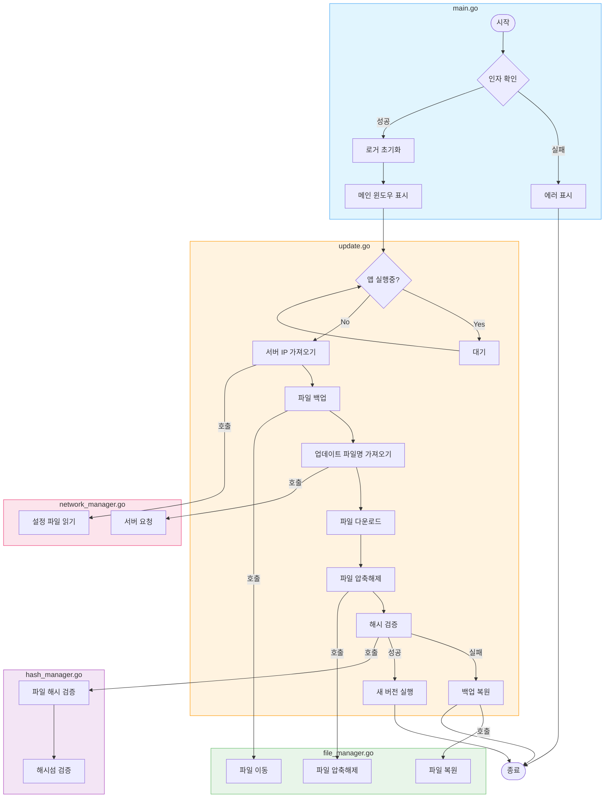

# 빌드하는 방법

```bash
fyne package -icon icon.png -name updater
```


## 커스텀 아이콘 사용하는 방법

```bash
fyne bundle -o bundled.go icon.png
```

```go
    icon := fyne.NewStaticResource("icon", resourceIconPng.StaticContent)

	ui.spinnerIcon = widget.NewIcon(icon)
	ui.spinnerIcon.Resize(fyne.NewSize(50, 50))
```

위처럼 사용할 수 있다.


## update flow


